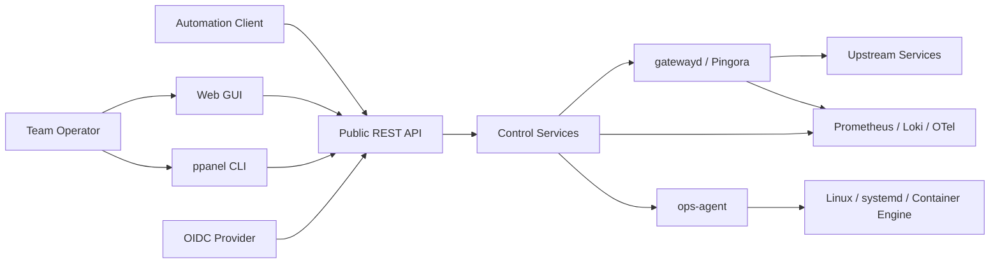
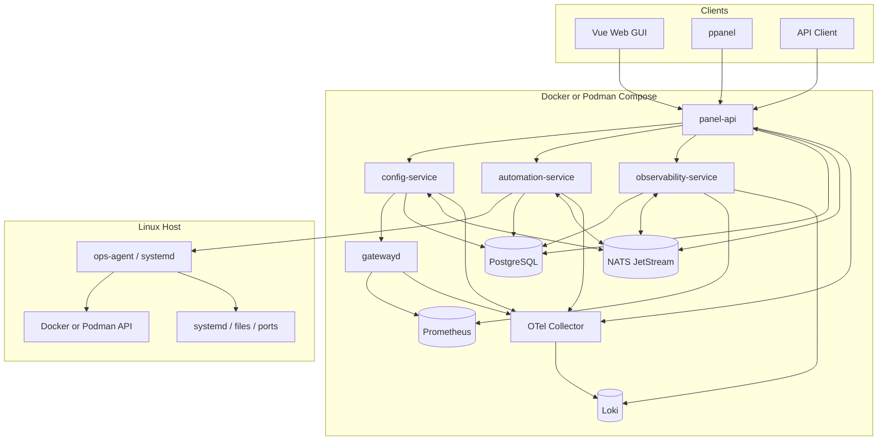
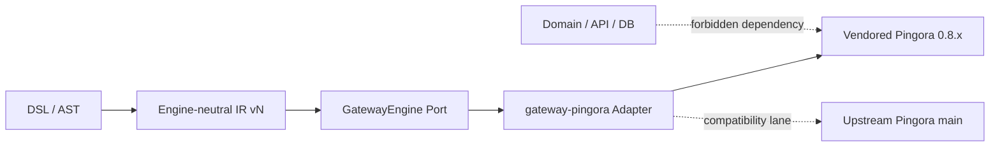
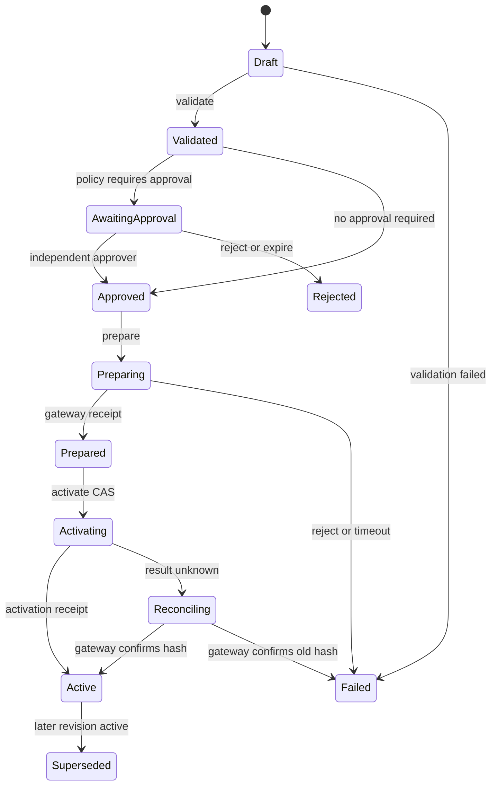
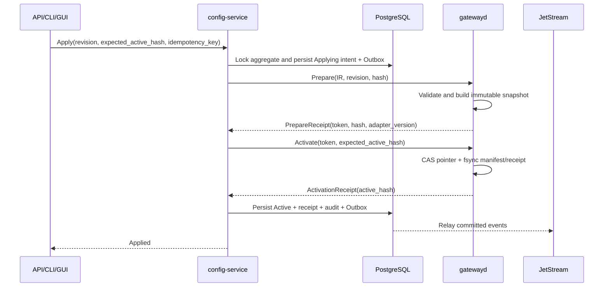
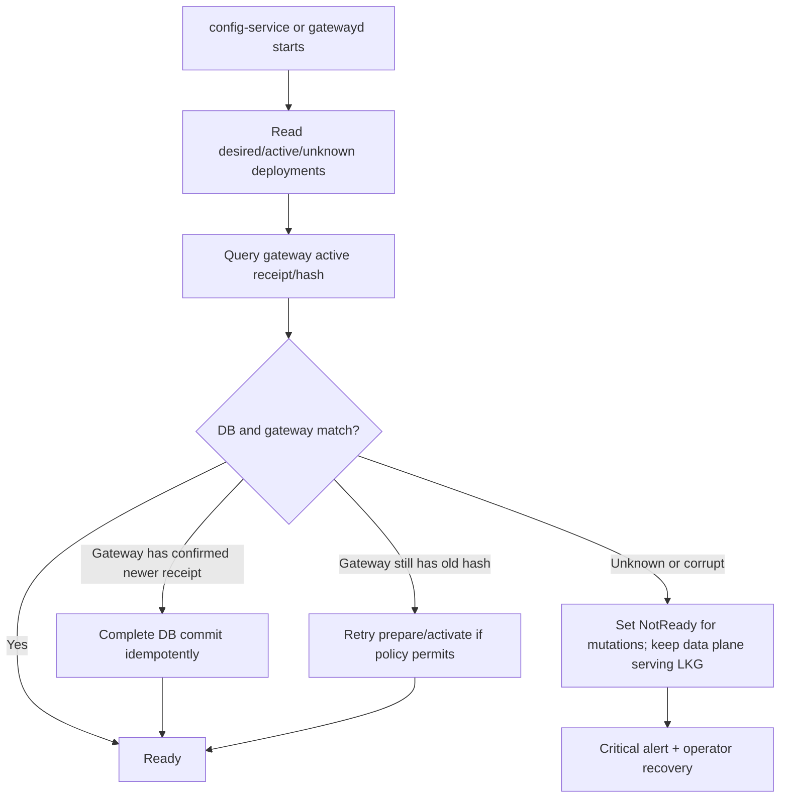
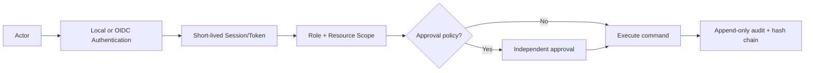

# Pingora Panel 综合产品规格

> 文档状态：Draft 0.1  
> 规格日期：2026-08-27  
> 产品状态：In Progress  
> Pingora crates 基线：0.8.0  
> 仓库基线：随本文件所在提交版本化  
> 许可证：Apache License 2.0

本文档是 Pingora Panel 的唯一权威产品规格（Single Source of Truth）。需求、接口、状态机、模块边界、发布门禁和功能状态以本文档为准。代码、Issue、里程碑与毕业论文可以引用本文档中的稳定 Feature ID，但不得另行定义冲突语义。

---

## 0. 全局工程原则

以下原则适用于产品架构、代码、配置格式、依赖选型、接口设计和运行运维；除非本文档明确记录例外，所有实现都必须遵守。

1. **极端模块化**：每个模块必须具有单一、清晰且可验证的职责，隐藏内部实现细节，并通过最小化的稳定接口协作。模块边界、依赖方向和所有权必须显式记录；禁止以共享可变状态、隐式全局变量或跨层直接访问规避边界。
2. **低耦合与契约隔离**：控制面、数据面、存储、传输、第三方集成和表现层必须通过稳定契约、port/adapter 或版本化 schema 连接。上层不得依赖下层具体实现，替换一个实现不应要求修改无关模块的业务语义或公共契约。
3. **面向扩展设计**：新增能力应优先通过既有接口、能力协商、provider、plugin 或 adapter 接入，而不是修改核心流程中的条件分支。扩展点必须定义生命周期、错误模型、兼容策略、权限边界、可观测性和回滚行为。
4. **隔离 BREAKING CHANGE**：外部 API、Proto、事件、DSL、数据库和持久化格式必须进行版本化并提供兼容窗口、迁移和回滚路径。上游依赖的 BREAKING CHANGE 必须被隔离在适配器或兼容层；不得将上游类型、未稳定 API 或实现细节泄漏到公共契约。
5. **优先采用成熟工具**：在满足需求的前提下，优先使用现代化、广泛采用、持续维护、文档和安全记录完整、许可证明确且升级路径可控的标准、框架、库和服务。对于已有合适方案的基础能力，禁止重复造轮子；自研必须有明确的差异化需求、约束或风险理由，并记录维护成本与退出路径。
6. **先调研、再决策、后行动**：开始实现或引入依赖前，必须先完成问题拆解和方案评估，至少比较需求适配度、成熟度、维护活跃度、安全性、许可证、性能、可观测性、升级兼容性和 BREAKING CHANGE 风险。结论、取舍与未决风险必须记录在 ADR 或等价设计记录中；未经评估不得凭短期流行度或个人偏好选型。

这些原则是架构评审、代码评审、依赖升级和发布验收的强制检查项。任何例外都必须说明影响范围、补偿措施、到期条件和责任人，并获得评审批准。

---

## 1. 规范约定

### 1.1 规范词

本文档使用以下规范级别：

| 词语 | 含义 |
|---|---|
| **MUST / 必须** | 不满足即不符合规格 |
| **MUST NOT / 禁止** | 出现即不符合规格 |
| **SHOULD / 应当** | 默认遵守，偏离必须记录理由 |
| **MAY / 可以** | 可选能力，不影响基础兼容性 |

### 1.2 状态

| 状态 | 定义 |
|---|---|
| `Planned` | 已进入规格，尚无可验证实现 |
| `In Progress` | 已开始实现，但尚未达到验收条件 |
| `Implemented` | 已实现并通过模块测试，尚未完成全部产品验收 |
| `Verified` | 已通过规格规定的自动化、集成、安全或人工验收 |

除 Pingora 上游自身已有的框架能力外，Pingora Panel 产品功能状态以功能矩阵为准。规格不得因存在同名上游 API 而把产品能力误记为 `Implemented`。

### 1.3 Surface 标识

| 标识 | 含义 |
|---|---|
| `A` | Public REST API |
| `C` | `ppanel` CLI |
| `G` | Web GUI |
| `I` | Internal gRPC / service capability |
| `S` | Surface-specific，仅属于某种表现形式 |

所有业务查询和变更必须以 Public API 为契约，并同时提供 CLI 与 GUI 入口。暗色模式、图形拓扑、CLI shell completion 等纯表现能力可以标记 `S`，不制造没有实际意义的伪对应入口。

### 1.4 Feature ID

Feature ID 一经发布不得复用。删除的 ID 保留为 `Deprecated`，并指向替代项。当前命名空间包括 `SITE`、`GATE`、`DOM`、`ROUTE`、`UP`、`CONTENT`、`HTTP`、`CACHE`、`TLS`、`DSL`、`LUA`、`SEC`、`AUDIT`、`OBS`、`CTR`、`HOST`、`BACKUP`、`CLI`、`API`、`GUI`、`IAM`、`PLAT`、`EXT`、`SUPPLY` 与 `OPS`。

---

## 2. 产品定义

### 2.1 产品定位

Pingora Panel 是一个面向团队运维的单节点网站网关控制平台。它以 Pingora 为数据面，以版本化 DSL 为规范配置源，统一提供 Web GUI、CLI 与 REST API，并围绕配置验证、审批、原子发布、回滚、审计、可观测性和可扩展代理逻辑建立完整产品闭环。

它不是 Pingora 的改名分叉，也不是以功能数量复制 1Panel/cPanel。Pingora Panel 的核心差异是：

1. 控制面与数据面通过稳定契约解耦。
2. 任何运行配置都来自可审查、可重放、可哈希的 DSL revision。
3. 失败发布不得改变当前 Active revision。
4. API、CLI、GUI 共用同一授权、命令、审计和幂等语义。
5. Pingora BREAKING CHANGE 只允许影响适配器边界。

### 2.2 目标用户

| Persona | 主要职责 | 典型入口 |
|---|---|---|
| Administrator | 安装、身份源、全局策略、密钥、特权集成 | GUI、CLI、API |
| Operator | 站点、路由、上游、证书、发布和故障处理 | GUI、CLI |
| Approver | 审阅 Diff、风险和计划窗口并批准发布 | GUI、API |
| Auditor | 查询不可变审计、登录、发布和特权操作 | GUI、CLI、API |
| Viewer | 查看状态、指标、日志和只读配置 | GUI、CLI |
| Automation Client | 通过短期 Token 或 OIDC workload identity 自动操作 | API、CLI |

### 2.3 1.0 范围

1.0 必须覆盖本文档功能目录中的全部非 `Future` Feature ID，并达到 `Verified`。范围包含网站、域名、路由、上游、静态内容、TLS/ACME、DSL、Lua、访问控制、缓存、日志指标、告警、容器、必要主机能力、备份、API、CLI、GUI、团队身份、审批、插件和供应链治理。

以下能力不进入 1.0，只提供明确扩展端口：

- 数据库管理 GUI
- 应用商店
- 邮件服务器与邮件托管
- 权威 DNS 托管
- Kubernetes 控制面
- 多节点或集群调度
- 完整通用文件管理器
- Hosting 计费、订阅与多租户配额

### 2.4 非目标

- 不宣称兼容全部 NGINX/OpenResty directive。
- 不把 Cloudflare 生产数据当作本产品性能结论。
- 不允许浏览器、CLI 或插件直接修改 PostgreSQL、Pingora 内存、Docker socket 或 systemd。
- 不承诺 Lua 是不可信多租户的强安全边界。
- 不在 1.0 动态创建任意 Pingora listener/service；首选固定 listener 与动态路由快照。

---

## 3. 当前状态与目标状态

### 3.1 当前仓库事实

当前仓库是 Pingora 0.8.0 的完整 Rust workspace，包含 `pingora-core`、`pingora-proxy`、`pingora-load-balancing`、TLS、缓存、指标等上游 crates，并包含针对 Rust 与 OpenResty 基线的 CI 调整。Pingora Panel 现处于 `In Progress / durable gateway foundation`：`panel/` 独立 workspace 已提供 Proto-first 契约、稳定错误模型、领域值对象、Engine-neutral IR、`GatewayEngine`/`SnapshotStore`/`DataPlaneAdapter`/`GatewayRuntimeInfoProvider` ports、内存 `FakeGatewayEngine`、独立 durable runtime、原子文件快照存储、Pingora 0.8.0 adapter、Tonic gRPC transport、标准 gRPC Health、`gatewayd` 组合根、v1/v2 磁盘格式 Golden Fixture、真实 TCP 与文件系统故障黑盒测试、有界 mutation admission、两阶段 readiness drain、plaintext loopback-only 管理绑定、恢复诊断、Proto compatibility guard 自测试、security lockfile resolver hermetic 自测试和依赖边界检查。控制服务、DSL 编译服务、数据库迁移、CLI、Web GUI、REST API、内部 mTLS 和生产 listener 仍未实现。

Initial Foundation 验证基线（检查日期：2026-08-30；仓库提交：`665fd57`；Pingora crates：`0.8.0`；许可证：Apache-2.0）：

- `Implemented`：十个 Panel crate 的严格边界、动态生成 Proto 契约、稳定错误转换、领域值对象、版本化 IR 结构与确定性 canonical hash、`GatewayEngine`/`SnapshotStore`/`DataPlaneAdapter` 接口、durable runtime、原子文件存储、`gatewayd` gRPC 服务与标准 Health、Activation Receipt 持久化和 LKG 重启恢复。
- `Verified`：`FakeGatewayEngine` 的 capability negotiation、Prepare/Activate/Abort/CAS 语义与失败原子性；`gateway-pingora` 在本地 Pingora 0.8.0 上的 adapter compile smoke test、HTTP/HTTPS peer mapping、未支持节点的结构化拒绝；Panel Pingora 依赖边界自动检查；真实 `gatewayd` 的 SIGTERM、同端口重启、服务状态、版本、uptime 和配置 worker 数查询。
- `Planned`：PostgreSQL、NATS、控制服务、REST/OpenAPI、`ppanel` CLI、Vue GUI、生产 listener、TLS/cache/Lua 执行能力和 Pingora upstream canary。

上述状态只覆盖 Initial Foundation，不把面板完整功能目录误写为已实现。
进程级 shutdown 与运行信息测试是 `gatewayd` 基础设施验收证据；在生产 Pingora listener、权限检查和操作审计接入前，`GATE-002` 至 `GATE-006` 仍保持 `Planned`，不得用基础设施测试替代完整产品验收。

### 3.2 目标仓库边界

Pingora 上游 crates 继续保留在根 workspace，以便固定版本、审计源码、紧急打补丁和进行兼容测试。产品代码统一进入 `panel/` 边界。只有 `panel/gateway-pingora` 可以在 `Cargo.toml` 中依赖 `pingora-*`；其他产品 crate 只能依赖稳定的 `GatewayEngine` port 与 Engine-neutral IR。

禁止直接修改上游 crate。确需临时修补安全或正确性问题时，必须：

1. 建立带上游 Issue/PR 链接的 patch 记录。
2. 附回归测试和受影响版本范围。
3. 在兼容矩阵中标记偏差。
4. 上游发布修复后优先删除本地 patch。

---

## 4. 系统上下文



系统首先服务单台 Linux 主机上的团队协作。API 面向受控管理网络；数据面监听业务端口。控制面不可因为管理 API 故障而中断已激活的流量快照。

---

## 5. 服务拓扑与模块职责



### 5.1 `panel-api`

- 唯一公共管理入口，提供 `/api/v1`、OpenAPI、SSE/WebSocket 状态流和 Web 静态资源。
- 负责本地登录、OIDC callback、Session/API Token、CSRF、RBAC、请求幂等与限流。
- 只编排用例，不拥有配置编译和主机特权逻辑。
- 不得直接查询 Loki/Prometheus、调用容器 socket 或依赖 Pingora crate。

### 5.2 `config-service`

- 独占 Site、Domain、Route、Upstream、Certificate Reference、DSL、Revision、Approval、Deploy Receipt 的写模型。
- 执行 parse、semantic validation、plan、approval、prepare、activate、rollback 和 reconciliation。
- 通过 gRPC 调用 `gatewayd`，通过 Outbox 发布配置领域事件。
- 不把 Pingora 类型写入数据库或外部契约。

### 5.3 `gatewayd`

- 承载 Pingora 数据面、固定 listener、Engine-neutral IR 校验和 Runtime Snapshot 构造。
- 只有内部 `gateway-pingora` 适配器依赖上游 `pingora-*`。
- 保持最后可用快照，即使控制面、PostgreSQL或 NATS 不可用也继续代理。
- 输出版本、配置 Hash、连接、路由、上游、TLS、Lua 与错误指标。

### 5.4 `automation-service`

- 处理 ACME、证书续期、备份恢复、通知、容器工作流、计划发布和长任务。
- 使用 JetStream durable consumer；所有任务必须有幂等键、租约、重试策略和 Dead Letter Queue。
- 需要主机权限的步骤只能调用 `ops-agent` allowlist operation。

### 5.5 `observability-service`

- 封装 Prometheus、Loki 和可选 trace backend 查询。
- 提供 Dashboard、日志 Tail/Search、告警规则和事件关联 API。
- 不允许 GUI 直接持有可观测后端凭据。

### 5.6 `ops-agent`

- 以宿主机原生 systemd 服务运行，默认不暴露 TCP。
- 通过权限受限 UDS 接收版本化 gRPC 请求，并校验 peer identity、operation、resource scope 与 request signature。
- 提供 systemd、端口诊断、受限文件、Docker/Podman、备份目录和证书权限操作。
- 拒绝任意 shell、任意路径和任意 Docker API passthrough。

### 5.7 数据所有权

| 服务 | PostgreSQL schema | 可写实体 |
|---|---|---|
| `panel-api` | `identity` | users、sessions、tokens、roles、bindings |
| `config-service` | `config` | sites、revisions、approvals、deployments、receipts |
| `automation-service` | `automation` | jobs、schedules、leases、delivery attempts |
| `observability-service` | `observability` | alert rules、silences、saved queries |
| shared audit writer | `audit` | append-only audit records、hash checkpoints |

服务禁止跨 schema 写入。跨服务一致性使用 API、gRPC、Outbox 和可重放事件完成，不使用共享表触发隐式耦合。

---

## 6. Pingora BREAKING CHANGE 隔离



### 6.1 `GatewayEngine` port

稳定 port 至少包含：

```rust
trait GatewayEngine {
    async fn capabilities(&self) -> EngineCapabilities;
    async fn validate(&self, snapshot: EngineIr) -> ValidationReport;
    async fn prepare(&self, request: PrepareRequest) -> PrepareReceipt;
    async fn activate(&self, request: ActivateRequest) -> ActivationReceipt;
    async fn abort(&self, prepare_token: PrepareToken) -> AbortReceipt;
    async fn status(&self) -> GatewayStatus;
}
```

上式是契约级伪代码，不绑定最终 Rust async trait 实现。`EngineIr`、Receipt、Error Code 和 Capability 都属于 Pingora Panel，不得复用 Pingora struct。

### 6.2 兼容矩阵

| Product | IR | Adapter | Pinned Pingora | Upstream canary | 状态 |
|---|---|---|---|---|---|
| 0.1 | v1 | pingora-v1 | 0.8.0 / exact commit | `main` allow-failure | Planned |

每次升级必须记录 API 变化、语义变化、性能变化、安全公告、迁移步骤和回滚办法。缓存等上游标记为 experimental/volatile 的 API 必须再包一层 capability，不得成为公共稳定承诺的直接依据。

### 6.3 CI 门禁

- `cargo metadata`/架构检查确保只有适配器依赖 `pingora-*`。
- 固定版本 lane 必须通过编译、契约、集成、故障和性能回归。
- 上游 `main` canary 定期运行；失败创建兼容 Issue，但在未确认安全影响时不自动升级生产基线。
- 适配器契约测试必须可以替换为 Fake Engine，控制面测试不得启动真实 Pingora。

---

## 7. DSL、AST 与 IR

### 7.1 规范配置源

DSL revision 是运行配置的规范源。GUI 表单和 CLI 命令最终都生成或修改 Draft DSL；任何直接构造 Runtime Snapshot 的旁路都被禁止。

配置实体包括：

| 实体 | 关键标识 | 说明 |
|---|---|---|
| Site | stable UUID、name | 聚合 Domain、Route 与策略 |
| Domain | normalized host pattern | IDNA 后存储并检查冲突 |
| ListenerRef | fixed listener ID | 引用预配置 listener，不动态创建 service |
| Route | stable UUID、priority | 显式 matcher 与 action |
| UpstreamPool | stable UUID | 节点、健康、均衡、重试 |
| CertificateRef | secret/resource ID | DSL 不包含私钥明文 |
| LuaScriptRef | immutable version ID | 受信管理员脚本及 capability |
| Revision | monotonic ID、content hash | 不可变配置版本 |

### 7.2 编译流水线


每阶段必须产生结构化诊断，至少包含 `code`、`severity`、`message`、`source_span`、`resource_id` 与 `help`。未知指令默认是错误；Deprecated 指令必须给出替代项和移除版本。

### 7.3 DSL 兼容策略

- 使用 `http`、`server`、`upstream`、`route`、`include` 等熟悉结构，但不声明完整 NGINX 兼容。
- `location` 只作为受限导入别名；规范输出统一为 `route`。
- matcher 明确写为 `exact`、`prefix`、`glob` 或 `regex`，不复制 NGINX 隐式优先级。
- duration、size、CIDR、boolean 和 resource reference 在 parser/semantic 阶段类型化。
- 复杂 directive 使用 `key=value`，继承规则必须可通过 Explain API 查询。
- NGINX 导入器只接受文档列出的子集，不支持项生成迁移报告而非静默忽略。

### 7.4 版本与兼容

DSL 文件声明 `language_version`，IR 声明 `schema_version`。读取旧版本时必须通过显式迁移器升级；写出始终使用当前规范格式。迁移必须幂等，并保留原文、迁移后文和 Diff。

### 7.5 JSON 与 Python 职责边界

保持一个原则：

> JSON：声明事实和例外  
> Python：承载逻辑

JSON 只能描述事实、配置值和明确的例外；Python 负责承载条件判断、策略编排和其他业务逻辑。不得让 JSON 开始承载以下内容：

- 条件表达式
- 控制流
- 正则逻辑
- 继承
- 动态计算

需要表达上述行为时，必须在 Python 中实现，并通过经过校验的 JSON 字段、枚举、引用或结果传递给配置层。JSON Schema 只负责结构和类型校验，不负责执行逻辑或解释可执行内容。

---

## 8. Revision、审批与原子发布

### 8.1 状态机



`Failed` revision 不会自动变成 `RolledBack`。回滚是从历史 revision 复制内容并创建一个新的 Draft，再经过完整验证、审批和发布。

### 8.2 发布协议



### 8.3 不变量

1. 单节点任一时刻最多有一个 Active revision。
2. Active revision 必须通过 schema、semantic、policy 和 adapter validation。
3. Apply 失败时，之前的 active hash 保持不变。
4. Activate 必须携带 `expected_active_hash`，并发修改不允许 last-write-wins。
5. 每个变更都有 actor、request ID、idempotency key、before/after hash、结果和时间。
6. 已批准的内容发生任何字节变化后，批准立即失效。

### 8.4 崩溃恢复



`gatewayd` 必须在持久卷通过临时文件、fsync、原子 rename 保存 snapshot manifest 和 activation receipt。控制面故障不得删除最后可用快照。

---

## 9. 公共 API、CLI 与 GUI

### 9.1 REST API

- Base path：`/api/v1`
- Content type：`application/json`
- 契约：OpenAPI 3.1
- 错误：RFC 9457 Problem Details，并扩展 `code`、`request_id`、`field_errors`、`retryable`
- 幂等：所有可重试 mutation 接受 `Idempotency-Key`
- 并发：资源更新使用 ETag/`If-Match` 或显式 expected revision
- 长任务：返回 `202 Accepted` 与 Job resource
- 分页：cursor based，不使用不稳定 offset 作为唯一方式
- 时间：RFC 3339 UTC；GUI 按用户时区显示

核心资源包括：

```text
/api/v1/sites
/api/v1/domains
/api/v1/routes
/api/v1/upstreams
/api/v1/certificates
/api/v1/lua-scripts
/api/v1/revisions
/api/v1/deployments
/api/v1/approvals
/api/v1/audit-events
/api/v1/jobs
/api/v1/alerts
/api/v1/container-engines
/api/v1/gateway/status
```

### 9.2 Internal gRPC

Protobuf package 使用 `pingora.panel.<domain>.v1`。容器间默认 mTLS TCP；`ops-agent` 默认 UDS。协议遵循：

- 只允许 additive change。
- 删除字段必须 `reserved` 原 field number 和 name。
- 所有 mutation 带 request ID、actor identity、deadline 和 idempotency key。
- Error 使用稳定 code，不依赖 Rust error string。
- 每个服务报告 protocol、build、schema 和 capability 版本。

### 9.3 Event Envelope

JetStream 事件统一包含：

```text
event_id, event_type, event_version, occurred_at, producer,
aggregate_type, aggregate_id, correlation_id, causation_id,
idempotency_key, actor, payload
```

投递语义为 at-least-once；消费者必须幂等。Outbox relay 只有在 PostgreSQL 事务提交后才发布。无法处理的事件进入 DLQ 并触发告警，不得无限快速重试。

### 9.4 CLI

CLI 固定使用 `ppanel <resource> <action>`，例如：

```bash
ppanel site create --file site.dsl
ppanel config validate --file gateway.dsl
ppanel config plan --revision r42
ppanel config apply --revision r42 --wait
ppanel config rollback --to r41 --reason "incident-123"
ppanel gateway status --output json
ppanel audit list --correlation-id req_01...
```

支持本地/远程 profile、OIDC device flow、短期 Token、`table|json|yaml` 输出、`--quiet`、`--dry-run`、shell completion 和稳定退出码。CLI 不允许直接读写 PostgreSQL 或本地 DSL 事实源。

### 9.5 Web GUI

GUI 信息架构包括 Dashboard、Sites、Routes、Upstreams、Certificates、Config Studio、Lua、Deployments、Approvals、Traffic、Logs、Alerts、Containers、Host、Backups、Team、Audit 与 Settings。所有状态明确显示 revision、hash、数据时间和 loading/error/empty/stale 状态；配置发布必须展示 Diff、验证结果、影响范围和审批状态。

---

## 10. 身份、权限与审批



### 10.1 身份

- 安装时创建一次性 bootstrap token，并强制建立首个本地 Administrator。
- 本地密码使用 Argon2id；Session 使用不可预测 opaque ID，服务端保存 hash。
- OIDC 使用 Authorization Code + PKCE，校验 issuer、audience、nonce、state 与签名。
- 保留受严格限制的本地 break-glass Administrator；其使用必须触发高优先级告警。
- API Token 只显示一次，数据库保存 hash，必须有 scope、过期时间和撤销能力。

### 10.2 RBAC

授权模型为 `subject × action × resource scope × condition`。默认拒绝。角色是权限集合，不在业务代码中硬编码角色名判断。资源范围支持全局、Site Group、Site 和只读日志范围。

### 10.3 审批

- 策略可按环境标签、Site Group、风险等级、操作类型和时间窗口要求审批。
- 申请人与批准人必须不同；批准时固定 revision hash。
- 批准有有效期，可撤回；内容变化、超时或策略变化使批准失效。
- 紧急绕过仅 Administrator 可用，必须填写理由、关联事件并产生不可静默的告警和审计。

---

## 11. 安全模型

### 11.1 信任边界

| 边界 | 主要风险 | 必须控制 |
|---|---|---|
| Browser → `panel-api` | Session 劫持、CSRF、XSS | Secure/HttpOnly/SameSite、CSRF token、CSP、Origin 检查 |
| API → internal services | 身份伪造、横向移动 | mTLS workload identity、最小 ACL、deadline |
| `config-service` → `gatewayd` | 恶意/损坏快照 | IR schema、hash、CAS、adapter validation |
| service → PostgreSQL | 越权写入 | 独立账号/schema、TLS、最小 grant |
| service → JetStream | 伪造/重放事件 | account/subject ACL、event ID、幂等消费者 |
| control plane → `ops-agent` | root RCE | UDS peer auth、operation allowlist、路径约束、签名 |
| Lua → request pipeline | CPU/内存耗尽、能力滥用 | 受信角色、配额、capability、超时、版本回滚 |
| user upstream input | SSRF、metadata 访问 | scheme/address policy、DNS rebind 防护、显式私网策略 |

内部 mTLS 完成前，`gatewayd` plaintext 管理 listener 必须限制在 IPv4/IPv6 loopback；非 loopback 配置启动失败。该限制只能由组合根显式注入的已认证 transport policy 替换，禁止通过隐式环境开关降级。

### 11.2 Secret

DSL 和事件中禁止出现私钥、密码、Session 或长期 Token。默认 Secret Provider 使用容器 Secret/宿主机权限文件提供 master key，对数据库 Secret 进行 envelope encryption；接口允许后续接入 Vault/KMS。日志、审计、诊断包和错误消息必须执行字段级脱敏。

### 11.3 Lua

Lua 仅允许具有受信脚本权限的 Administrator 创建或发布。默认关闭 `os`、任意 `io`、动态库、FFI、任意网络和进程执行，只暴露版本化 `req`、`resp`、`ctx`、`upstream`、`log`、`crypto` capability。每次执行限制指令数、墙钟时间和 VM 内存；超限使用明确 fallback，并记录指标。沙箱是纵深防御，不是多租户隔离承诺。

### 11.4 供应链

- Rust、Node、容器和系统依赖生成 SBOM。
- Release artifact、镜像、SBOM 和 provenance 必须签名。
- CI 执行依赖漏洞、许可证、Secret、SAST 和容器扫描。
- Critical/High 问题必须处置、缓解或由安全负责人记录限时例外，1.0 不允许未解释的 Critical/High。
- Pingora request framing、cache 和已知 ingress advisory 建立本地回归测试。

---

## 12. 可观测性与可靠性

### 12.1 Telemetry

- 指标：Prometheus pull endpoint，包含 service、gateway、route、upstream、TLS、cache、Lua、job 和 revision labels；禁止无界 label。
- 日志：结构化 JSON，经 OTel Collector/agent 发送 Loki，保留 request ID、trace ID、site/route ID 和 revision ID。
- Trace：统一 W3C Trace Context；后端可选，但服务必须能发 OTLP。
- GUI 只调用 `observability-service`，不直接访问 Prometheus/Loki。

### 12.2 SLO 初始目标

| 指标 | 目标 |
|---|---|
| 已激活数据面可用性 | 每月 99.9%，不把受控 upstream 故障计为平台故障 |
| 配置发布正确性 | 失败发布保持旧 active hash：100% |
| 审计完整性 | 所有 mutation 存在可验证 Audit Event：100% |
| API/CLI/GUI 业务语义一致 | 目录内非 Surface-specific 能力：100% |
| 恢复目标 | 控制面 RPO 5 分钟以内；数据面 LKG RPO 0 |

SLO 是初始工程目标，不是未经测量的性能结论。吞吐、延迟和资源基线必须由固定环境、重复实验和原始数据建立。

### 12.3 Backpressure

Gateway 请求路径不得同步依赖 PostgreSQL、NATS、Prometheus 或 Loki。Telemetry 队列满时按策略采样/丢弃并计数，不能阻塞代理。JetStream consumer、WebSocket/SSE 和日志 Tail 必须有缓冲上限、慢消费者断开和恢复游标。

---

## 13. 部署、升级与备份

### 13.1 支持矩阵

- Tier 1：Linux x86_64/aarch64、systemd、Docker Compose、Podman Compose。
- `gatewayd` 使用 host network 或经验证的等价网络模式，授予最小 `CAP_NET_BIND_SERVICE`，不使用 privileged container。
- `ops-agent` 为原生服务；Docker/Podman socket 只对 agent 可见。
- PostgreSQL、NATS、Prometheus、Loki 和 OTel Collector 使用持久卷与显式版本锁定。

### 13.2 升级顺序

1. 备份数据库、DSL revisions、Secret metadata、gateway LKG manifest 和部署配置。
2. 执行只读 preflight，验证协议、数据库迁移和磁盘空间。
3. 先升级向后兼容的消费者/服务，再升级生产者。
4. 升级 `gatewayd` 前运行 adapter compatibility suite 并保留旧镜像。
5. 数据库 migration 采用 expand/contract，不在同一版本删除旧字段。
6. 健康检查和 reconciliation 完成后才结束维护窗口。

### 13.3 备份恢复

备份包含 PostgreSQL 一致性备份、规范 DSL、证书/Secret 加密材料、LKG manifest、Compose 配置和版本清单。恢复必须支持空主机演练，并验证 active revision/hash、证书引用、审计链和服务协议版本。Loki/Prometheus 历史数据可以独立设定备份策略，不得阻止核心配置恢复。

---

## 14. 扩展机制

### 14.1 内部扩展 port

内置能力通过 Rust trait/port 扩展，包括 Gateway Engine、Certificate Provider、DNS-01 Provider、Container Engine、Secret Provider、Notification Channel、Identity Connector、Telemetry Backend 和 Backup Target。内部 trait 不构成稳定第三方 ABI。

### 14.2 外部插件

第三方插件必须运行在独立进程，通过版本化 gRPC 注册 manifest、capability、健康状态和资源需求。禁止加载不稳定 Rust `cdylib` 作为官方插件接口。插件权限默认拒绝，必须经管理员显式授予；请求带 deadline，失败不得拖垮调用服务。

### 14.3 插件生命周期

插件具有 `Discovered → Validated → Enabled → Degraded/Disabled` 状态，支持签名验证、版本兼容、配置 schema、健康检查、升级/回滚和审计。插件不得绕过 API、RBAC、审批、Secret Provider 或 `ops-agent`。

---

## 15. 完整功能目录

### 15.1 字段

| 字段 | 含义 |
|---|---|
| Feature ID | 稳定分类 ID |
| Legacy | 原功能列表编号；新增项为 `-` |
| Requirement | 规范能力 |
| Phase | 首次计划交付版本 |
| Surface | A/C/G/I/S |
| Permission | 最低权限 |
| Dependency | 主要模块或资源 |
| Acceptance | 最小可验证结果 |
| Status | Planned/In Progress/Implemented/Verified |
| Thesis | 是否属于建议论文切片 |

以下目录完整承接原 580 项，并加入团队治理、可靠事件、插件、升级与供应链能力。每一项均是 1.0 门禁的一部分。

### 15.2 功能矩阵（685 项）

`Legacy` 列即原 1..580 编号到稳定 Feature ID 的完整映射。新增平台项使用 `-`。本表由需求基线校验生成；Feature ID 发布后只允许增加或 Deprecated，不允许重排复用。

| Feature ID | Legacy | Requirement | Phase | Surface | Permission | Dependency | Acceptance | Status | Thesis |
|---|---:|---|---:|---|---|---|---|---|---|
| SITE-001 | 1 | 网站总览 | 0.2 | A/C/G | Viewer | config-service | 查询“网站总览”返回授权范围内的确定结果，并包含数据时间或版本。 | Planned | No |
| SITE-002 | 2 | 运行网站数统计 | 0.2 | A/C/G | Viewer | config-service | 查询“运行网站数统计”返回授权范围内的确定结果，并包含数据时间或版本。 | Planned | No |
| SITE-003 | 3 | 停止网站数统计 | 0.2 | A/C/G | Viewer | config-service | 查询“停止网站数统计”返回授权范围内的确定结果，并包含数据时间或版本。 | Planned | No |
| SITE-004 | 4 | 异常网站数统计 | 0.2 | A/C/G | Viewer | config-service | 查询“异常网站数统计”返回授权范围内的确定结果，并包含数据时间或版本。 | Planned | No |
| SITE-005 | 5 | HTTPS 网站数统计 | 0.2 | A/C/G | Viewer | config-service | 查询“HTTPS 网站数统计”返回授权范围内的确定结果，并包含数据时间或版本。 | Planned | No |
| SITE-006 | 6 | 反向代理网站数统计 | 0.2 | A/C/G | Viewer | config-service | 查询“反向代理网站数统计”返回授权范围内的确定结果，并包含数据时间或版本。 | Planned | No |
| SITE-007 | 7 | 静态网站数统计 | 0.2 | A/C/G | Viewer | config-service | 查询“静态网站数统计”返回授权范围内的确定结果，并包含数据时间或版本。 | Planned | No |
| SITE-008 | 8 | 新建反向代理网站 | 0.2 | A/C/G | Operator | config-service | 执行“新建反向代理网站”后状态符合契约；拒绝与失败路径不产生部分状态，并记录审计。 | Planned | No |
| SITE-009 | 9 | 新建静态网站 | 0.2 | A/C/G | Operator | config-service | 执行“新建静态网站”后状态符合契约；拒绝与失败路径不产生部分状态，并记录审计。 | Planned | No |
| SITE-010 | 10 | 新建纯重定向网站 | 0.2 | A/C/G | Operator | config-service | 执行“新建纯重定向网站”后状态符合契约；拒绝与失败路径不产生部分状态，并记录审计。 | Planned | No |
| SITE-011 | 11 | 新建维护页网站 | 0.2 | A/C/G | Operator | config-service | 执行“新建维护页网站”后状态符合契约；拒绝与失败路径不产生部分状态，并记录审计。 | Planned | No |
| SITE-012 | 12 | 克隆网站 | 0.2 | A/C/G | Operator | config-service | 执行“克隆网站”后状态符合契约；拒绝与失败路径不产生部分状态，并记录审计。 | Planned | No |
| SITE-013 | 13 | 导入网站配置 | 0.2 | A/C/G | Operator | config-service | 执行“导入网站配置”后状态符合契约；拒绝与失败路径不产生部分状态，并记录审计。 | Planned | No |
| SITE-014 | 14 | 导出网站配置 | 0.2 | A/C/G | Operator | config-service | 执行“导出网站配置”后状态符合契约；拒绝与失败路径不产生部分状态，并记录审计。 | Planned | No |
| SITE-015 | 15 | 网站启用 | 0.2 | A/C/G | Operator | config-service | 执行“网站启用”后状态符合契约；拒绝与失败路径不产生部分状态，并记录审计。 | Planned | No |
| SITE-016 | 16 | 网站停用 | 0.2 | A/C/G | Operator | config-service | 执行“网站停用”后状态符合契约；拒绝与失败路径不产生部分状态，并记录审计。 | Planned | No |
| SITE-017 | 17 | 网站删除 | 0.2 | A/C/G | Operator | config-service | 执行“网站删除”后状态符合契约；拒绝与失败路径不产生部分状态，并记录审计。 | Planned | No |
| SITE-018 | 18 | 网站软删除 | 0.2 | A/C/G | Operator | config-service | 执行“网站软删除”后状态符合契约；拒绝与失败路径不产生部分状态，并记录审计。 | Planned | No |
| SITE-019 | 19 | 网站恢复 | 0.2 | A/C/G | Operator | config-service | 执行“网站恢复”后状态符合契约；拒绝与失败路径不产生部分状态，并记录审计。 | Planned | No |
| SITE-020 | 20 | 网站分组 | 0.2 | A/C/G | Operator | config-service | 执行“网站分组”后状态符合契约；拒绝与失败路径不产生部分状态，并记录审计。 | Planned | No |
| SITE-021 | 21 | 网站标签 | 0.2 | A/C/G | Operator | config-service | 执行“网站标签”后状态符合契约；拒绝与失败路径不产生部分状态，并记录审计。 | Planned | No |
| SITE-022 | 22 | 网站备注 | 0.2 | A/C/G | Operator | config-service | 执行“网站备注”后状态符合契约；拒绝与失败路径不产生部分状态，并记录审计。 | Planned | No |
| SITE-023 | 23 | 网站收藏 | 0.2 | A/C/G | Operator | config-service | 执行“网站收藏”后状态符合契约；拒绝与失败路径不产生部分状态，并记录审计。 | Planned | No |
| SITE-024 | 24 | 网站关键词搜索 | 0.2 | A/C/G | Viewer | config-service | 查询“网站关键词搜索”返回授权范围内的确定结果，并包含数据时间或版本。 | Planned | No |
| SITE-025 | 25 | 按状态筛选 | 0.2 | A/C/G | Viewer | config-service | 查询“按状态筛选”返回授权范围内的确定结果，并包含数据时间或版本。 | Planned | No |
| SITE-026 | 26 | 按类型筛选 | 0.2 | A/C/G | Viewer | config-service | 查询“按类型筛选”返回授权范围内的确定结果，并包含数据时间或版本。 | Planned | No |
| SITE-027 | 27 | 按域名筛选 | 0.2 | A/C/G | Viewer | config-service | 查询“按域名筛选”返回授权范围内的确定结果，并包含数据时间或版本。 | Planned | No |
| SITE-028 | 28 | 按标签筛选 | 0.2 | A/C/G | Viewer | config-service | 查询“按标签筛选”返回授权范围内的确定结果，并包含数据时间或版本。 | Planned | No |
| SITE-029 | 29 | 网站排序 | 0.2 | A/C/G | Operator | config-service | 执行“网站排序”后状态符合契约；拒绝与失败路径不产生部分状态，并记录审计。 | Planned | No |
| SITE-030 | 30 | 批量启动 | 0.2 | A/C/G | Operator | config-service | 执行“批量启动”后状态符合契约；拒绝与失败路径不产生部分状态，并记录审计。 | Planned | No |
| SITE-031 | 31 | 批量停止 | 0.2 | A/C/G | Operator | config-service | 执行“批量停止”后状态符合契约；拒绝与失败路径不产生部分状态，并记录审计。 | Planned | No |
| SITE-032 | 32 | 批量删除 | 0.2 | A/C/G | Operator | config-service | 执行“批量删除”后状态符合契约；拒绝与失败路径不产生部分状态，并记录审计。 | Planned | No |
| SITE-033 | 33 | 批量验证配置 | 0.2 | A/C/G | Operator | config-service | 执行“批量验证配置”后状态符合契约；拒绝与失败路径不产生部分状态，并记录审计。 | Planned | No |
| SITE-034 | 34 | 网站配置草稿 | 0.3 | A/C/G | Operator | config-service | 执行“网站配置草稿”后状态符合契约；拒绝与失败路径不产生部分状态，并记录审计。 | Planned | Yes |
| SITE-035 | 35 | 草稿保存 | 0.3 | A/C/G | Operator | config-service | 执行“草稿保存”后状态符合契约；拒绝与失败路径不产生部分状态，并记录审计。 | Planned | Yes |
| SITE-036 | 36 | 草稿预览 | 0.3 | A/C/G | Viewer | config-service | 查询“草稿预览”返回授权范围内的确定结果，并包含数据时间或版本。 | Planned | Yes |
| SITE-037 | 37 | 草稿与生效配置 Diff | 0.3 | A/C/G | Viewer | config-service | 查询“草稿与生效配置 Diff”返回授权范围内的确定结果，并包含数据时间或版本。 | Planned | Yes |
| SITE-038 | 38 | 配置版本历史 | 0.3 | A/C/G | Operator | config-service | 执行“配置版本历史”后状态符合契约；拒绝与失败路径不产生部分状态，并记录审计。 | Planned | Yes |
| SITE-039 | 39 | 配置版本备注 | 0.3 | A/C/G | Operator | config-service | 执行“配置版本备注”后状态符合契约；拒绝与失败路径不产生部分状态，并记录审计。 | Planned | Yes |
| SITE-040 | 40 | 一键回滚配置 | 0.3 | A/C/G | Operator | config-service | 执行“一键回滚配置”后状态符合契约；拒绝与失败路径不产生部分状态，并记录审计。 | Planned | Yes |
| SITE-041 | 41 | 配置合法性检查 | 0.3 | A/C/G | Operator | config-service | 执行“配置合法性检查”后状态符合契约；拒绝与失败路径不产生部分状态，并记录审计。 | Planned | Yes |
| SITE-042 | 42 | 配置语义检查 | 0.3 | A/C/G | Operator | config-service | 执行“配置语义检查”后状态符合契约；拒绝与失败路径不产生部分状态，并记录审计。 | Planned | Yes |
| SITE-043 | 43 | 配置冲突检查 | 0.3 | A/C/G | Operator | config-service | 执行“配置冲突检查”后状态符合契约；拒绝与失败路径不产生部分状态，并记录审计。 | Planned | Yes |
| SITE-044 | 44 | 配置 Dry-run | 0.3 | A/C/G | Operator | config-service | 执行“配置 Dry-run”后状态符合契约；拒绝与失败路径不产生部分状态，并记录审计。 | Planned | Yes |
| SITE-045 | 45 | 配置原子发布 | 0.3 | A/C/G | Operator | config-service | 执行“配置原子发布”后状态符合契约；拒绝与失败路径不产生部分状态，并记录审计。 | Planned | Yes |
| GATE-001 | 46 | Pingora graceful reload | 0.2 | I | Operator | gatewayd | 执行“Pingora graceful reload”后状态符合契约；拒绝与失败路径不产生部分状态，并记录审计。 | Planned | Yes |
| GATE-002 | 47 | Pingora graceful shutdown | 0.2 | I | Operator | gatewayd | 执行“Pingora graceful shutdown”后状态符合契约；拒绝与失败路径不产生部分状态，并记录审计。 | Planned | No |
| GATE-003 | 48 | Pingora 服务状态 | 0.2 | I | Viewer | gatewayd | 查询“Pingora 服务状态”返回授权范围内的确定结果，并包含数据时间或版本。 | Planned | No |
| GATE-004 | 49 | Pingora 运行时长 | 0.2 | I | Viewer | gatewayd | 查询“Pingora 运行时长”返回授权范围内的确定结果，并包含数据时间或版本。 | Planned | No |
| GATE-005 | 50 | Pingora 版本展示 | 0.2 | I | Viewer | gatewayd | 查询“Pingora 版本展示”返回授权范围内的确定结果，并包含数据时间或版本。 | Planned | No |
| GATE-006 | 51 | Worker 数展示 | 0.2 | I | Viewer | gatewayd | 查询“Worker 数展示”返回授权范围内的确定结果，并包含数据时间或版本。 | Planned | No |
| GATE-007 | 52 | Worker 配置修改 | 0.2 | I | Operator | gatewayd | 执行“Worker 配置修改”后状态符合契约；拒绝与失败路径不产生部分状态，并记录审计。 | Planned | No |
| DOM-001 | 53 | 主域名管理 | 0.2 | A/C/G | Operator | config-service | 执行“主域名管理”后状态符合契约；拒绝与失败路径不产生部分状态，并记录审计。 | Planned | No |
| DOM-002 | 54 | 多域名绑定 | 0.2 | A/C/G | Operator | config-service | 执行“多域名绑定”后状态符合契约；拒绝与失败路径不产生部分状态，并记录审计。 | Planned | No |
| DOM-003 | 55 | 泛域名绑定 | 0.2 | A/C/G | Operator | config-service | 执行“泛域名绑定”后状态符合契约；拒绝与失败路径不产生部分状态，并记录审计。 | Planned | No |
| DOM-004 | 56 | 域名别名 | 0.2 | A/C/G | Operator | config-service | 执行“域名别名”后状态符合契约；拒绝与失败路径不产生部分状态，并记录审计。 | Planned | No |
| DOM-005 | 57 | 域名启停 | 0.2 | A/C/G | Operator | config-service | 执行“域名启停”后状态符合契约；拒绝与失败路径不产生部分状态，并记录审计。 | Planned | No |
| DOM-006 | 58 | 域名批量导入 | 0.2 | A/C/G | Operator | config-service | 执行“域名批量导入”后状态符合契约；拒绝与失败路径不产生部分状态，并记录审计。 | Planned | No |
| DOM-007 | 59 | 域名重复检测 | 0.2 | A/C/G | Operator | config-service | 执行“域名重复检测”后状态符合契约；拒绝与失败路径不产生部分状态，并记录审计。 | Planned | No |
| DOM-008 | 60 | 域名语法检测 | 0.2 | A/C/G | Operator | config-service | 执行“域名语法检测”后状态符合契约；拒绝与失败路径不产生部分状态，并记录审计。 | Planned | No |
| DOM-009 | 61 | IDN 域名转换 | 0.2 | A/C/G | Operator | config-service | 执行“IDN 域名转换”后状态符合契约；拒绝与失败路径不产生部分状态，并记录审计。 | Planned | No |
| DOM-010 | 62 | HTTP 监听 | 0.2 | A/C/G | Operator | config-service | 执行“HTTP 监听”后状态符合契约；拒绝与失败路径不产生部分状态，并记录审计。 | Planned | No |
| DOM-011 | 63 | HTTPS 监听 | 0.2 | A/C/G | Operator | config-service | 执行“HTTPS 监听”后状态符合契约；拒绝与失败路径不产生部分状态，并记录审计。 | Planned | No |
| DOM-012 | 64 | IPv4 监听 | 0.2 | A/C/G | Operator | config-service | 执行“IPv4 监听”后状态符合契约；拒绝与失败路径不产生部分状态，并记录审计。 | Planned | No |
| DOM-013 | 65 | IPv6 监听 | 0.2 | A/C/G | Operator | config-service | 执行“IPv6 监听”后状态符合契约；拒绝与失败路径不产生部分状态，并记录审计。 | Planned | No |
| DOM-014 | 66 | 自定义监听地址 | 0.2 | A/C/G | Operator | config-service | 执行“自定义监听地址”后状态符合契约；拒绝与失败路径不产生部分状态，并记录审计。 | Planned | No |
| DOM-015 | 67 | 自定义监听端口 | 0.2 | A/C/G | Operator | config-service | 执行“自定义监听端口”后状态符合契约；拒绝与失败路径不产生部分状态，并记录审计。 | Planned | No |
| DOM-016 | 68 | 端口冲突检测 | 0.2 | A/C/G | Operator | config-service | 执行“端口冲突检测”后状态符合契约；拒绝与失败路径不产生部分状态，并记录审计。 | Planned | No |
| DOM-017 | 69 | SO_REUSEPORT 配置 | 0.2 | A/C/G | Operator | config-service | 执行“SO_REUSEPORT 配置”后状态符合契约；拒绝与失败路径不产生部分状态，并记录审计。 | Planned | No |
| DOM-018 | 70 | HTTP/1.1 开关 | 0.2 | A/C/G | Operator | config-service | 执行“HTTP/1.1 开关”后状态符合契约；拒绝与失败路径不产生部分状态，并记录审计。 | Planned | No |
| DOM-019 | 71 | HTTP/2 开关 | 0.2 | A/C/G | Operator | config-service | 执行“HTTP/2 开关”后状态符合契约；拒绝与失败路径不产生部分状态，并记录审计。 | Planned | No |
| DOM-020 | 72 | HTTP/3 预留配置 | 0.2 | A/C/G | Operator | config-service | 执行“HTTP/3 预留配置”后状态符合契约；拒绝与失败路径不产生部分状态，并记录审计。 | Planned | No |
| DOM-021 | 73 | 默认虚拟主机 | 0.2 | A/C/G | Operator | config-service | 执行“默认虚拟主机”后状态符合契约；拒绝与失败路径不产生部分状态，并记录审计。 | Planned | No |
| DOM-022 | 74 | 未匹配域名拒绝 | 0.2 | A/C/G | Operator | config-service | 执行“未匹配域名拒绝”后状态符合契约；拒绝与失败路径不产生部分状态，并记录审计。 | Planned | No |
| DOM-023 | 75 | Host 大小写规范化 | 0.2 | A/C/G | Operator | config-service | 执行“Host 大小写规范化”后状态符合契约；拒绝与失败路径不产生部分状态，并记录审计。 | Planned | No |
| DOM-024 | 76 | SNI 与 Host 一致性检查 | 0.2 | A/C/G | Viewer | config-service | 查询“SNI 与 Host 一致性检查”返回授权范围内的确定结果，并包含数据时间或版本。 | Planned | No |
| DOM-025 | 77 | 域名跳转 WWW | 0.2 | A/C/G | Operator | config-service | 执行“域名跳转 WWW”后状态符合契约；拒绝与失败路径不产生部分状态，并记录审计。 | Planned | No |
| DOM-026 | 78 | 去 WWW 跳转 | 0.2 | A/C/G | Operator | config-service | 执行“去 WWW 跳转”后状态符合契约；拒绝与失败路径不产生部分状态，并记录审计。 | Planned | No |
| DOM-027 | 79 | HTTP 自动跳 HTTPS | 0.2 | A/C/G | Operator | config-service | 执行“HTTP 自动跳 HTTPS”后状态符合契约；拒绝与失败路径不产生部分状态，并记录审计。 | Planned | No |
| DOM-028 | 80 | HTTPS 可选关闭跳转 | 0.2 | A/C/G | Operator | config-service | 执行“HTTPS 可选关闭跳转”后状态符合契约；拒绝与失败路径不产生部分状态，并记录审计。 | Planned | No |
| ROUTE-001 | 81 | URI 精确匹配 | 0.2 | A/C/G | Operator | config-service | 执行“URI 精确匹配”后状态符合契约；拒绝与失败路径不产生部分状态，并记录审计。 | Planned | No |
| ROUTE-002 | 82 | URI 前缀匹配 | 0.2 | A/C/G | Operator | config-service | 执行“URI 前缀匹配”后状态符合契约；拒绝与失败路径不产生部分状态，并记录审计。 | Planned | No |
| ROUTE-003 | 83 | URI 正则匹配 | 0.2 | A/C/G | Operator | config-service | 执行“URI 正则匹配”后状态符合契约；拒绝与失败路径不产生部分状态，并记录审计。 | Planned | No |
| ROUTE-004 | 84 | URI 通配符匹配 | 0.2 | A/C/G | Operator | config-service | 执行“URI 通配符匹配”后状态符合契约；拒绝与失败路径不产生部分状态，并记录审计。 | Planned | No |
| ROUTE-005 | 85 | 匹配优先级 | 0.2 | A/C/G | Operator | config-service | 执行“匹配优先级”后状态符合契约；拒绝与失败路径不产生部分状态，并记录审计。 | Planned | No |
| ROUTE-006 | 86 | 命名路由 | 0.2 | A/C/G | Operator | config-service | 执行“命名路由”后状态符合契约；拒绝与失败路径不产生部分状态，并记录审计。 | Planned | No |
| ROUTE-007 | 87 | 路由启停 | 0.2 | A/C/G | Operator | config-service | 执行“路由启停”后状态符合契约；拒绝与失败路径不产生部分状态，并记录审计。 | Planned | No |
| ROUTE-008 | 88 | 路由排序 | 0.2 | A/C/G | Operator | config-service | 执行“路由排序”后状态符合契约；拒绝与失败路径不产生部分状态，并记录审计。 | Planned | No |
| ROUTE-009 | 89 | 路由拖拽调整优先级 | 0.2 | A/C/G | Operator | config-service | 执行“路由拖拽调整优先级”后状态符合契约；拒绝与失败路径不产生部分状态，并记录审计。 | Planned | No |
| ROUTE-010 | 90 | Method 匹配 | 0.6 | A/C/G | Operator | config-service | 执行“Method 匹配”后状态符合契约；拒绝与失败路径不产生部分状态，并记录审计。 | Planned | No |
| ROUTE-011 | 91 | Host 匹配 | 0.6 | A/C/G | Operator | config-service | 执行“Host 匹配”后状态符合契约；拒绝与失败路径不产生部分状态，并记录审计。 | Planned | No |
| ROUTE-012 | 92 | Header 匹配 | 0.6 | A/C/G | Operator | config-service | 执行“Header 匹配”后状态符合契约；拒绝与失败路径不产生部分状态，并记录审计。 | Planned | No |
| ROUTE-013 | 93 | Query 匹配 | 0.6 | A/C/G | Operator | config-service | 执行“Query 匹配”后状态符合契约；拒绝与失败路径不产生部分状态，并记录审计。 | Planned | No |
| ROUTE-014 | 94 | Cookie 匹配 | 0.6 | A/C/G | Operator | config-service | 执行“Cookie 匹配”后状态符合契约；拒绝与失败路径不产生部分状态，并记录审计。 | Planned | No |
| ROUTE-015 | 95 | Client IP 匹配 | 0.6 | A/C/G | Operator | config-service | 执行“Client IP 匹配”后状态符合契约；拒绝与失败路径不产生部分状态，并记录审计。 | Planned | No |
| ROUTE-016 | 96 | CIDR 匹配 | 0.6 | A/C/G | Operator | config-service | 执行“CIDR 匹配”后状态符合契约；拒绝与失败路径不产生部分状态，并记录审计。 | Planned | No |
| ROUTE-017 | 97 | User-Agent 匹配 | 0.6 | A/C/G | Operator | config-service | 执行“User-Agent 匹配”后状态符合契约；拒绝与失败路径不产生部分状态，并记录审计。 | Planned | No |
| ROUTE-018 | 98 | Referer 匹配 | 0.6 | A/C/G | Operator | config-service | 执行“Referer 匹配”后状态符合契约；拒绝与失败路径不产生部分状态，并记录审计。 | Planned | No |
| ROUTE-019 | 99 | Content-Type 匹配 | 0.6 | A/C/G | Operator | config-service | 执行“Content-Type 匹配”后状态符合契约；拒绝与失败路径不产生部分状态，并记录审计。 | Planned | No |
| ROUTE-020 | 100 | 多条件 AND | 0.6 | A/C/G | Operator | config-service | 执行“多条件 AND”后状态符合契约；拒绝与失败路径不产生部分状态，并记录审计。 | Planned | No |
| ROUTE-021 | 101 | 多条件 OR | 0.6 | A/C/G | Operator | config-service | 执行“多条件 OR”后状态符合契约；拒绝与失败路径不产生部分状态，并记录审计。 | Planned | No |
| ROUTE-022 | 102 | 条件 NOT | 0.6 | A/C/G | Operator | config-service | 执行“条件 NOT”后状态符合契约；拒绝与失败路径不产生部分状态，并记录审计。 | Planned | No |
| ROUTE-023 | 103 | 路由命中测试器 | 0.6 | A/C/G | Viewer | config-service | 查询“路由命中测试器”返回授权范围内的确定结果，并包含数据时间或版本。 | Planned | No |
| ROUTE-024 | 104 | 模拟请求匹配 | 0.6 | A/C/G | Operator | config-service | 执行“模拟请求匹配”后状态符合契约；拒绝与失败路径不产生部分状态，并记录审计。 | Planned | No |
| ROUTE-025 | 105 | 显示最终命中的 Route | 0.6 | A/C/G | Viewer | config-service | 查询“显示最终命中的 Route”返回授权范围内的确定结果，并包含数据时间或版本。 | Planned | No |
| UP-001 | 106 | 反向代理目标设置 | 0.2 | A/C/G | Operator | gatewayd | 执行“反向代理目标设置”后状态符合契约；拒绝与失败路径不产生部分状态，并记录审计。 | Planned | No |
| UP-002 | 107 | HTTP 上游 | 0.2 | A/C/G | Operator | gatewayd | 执行“HTTP 上游”后状态符合契约；拒绝与失败路径不产生部分状态，并记录审计。 | Planned | No |
| UP-003 | 108 | HTTPS 上游 | 0.2 | A/C/G | Operator | gatewayd | 执行“HTTPS 上游”后状态符合契约；拒绝与失败路径不产生部分状态，并记录审计。 | Planned | No |
| UP-004 | 109 | Unix Socket 上游预留 | 0.2 | A/C/G | Operator | gatewayd | 执行“Unix Socket 上游预留”后状态符合契约；拒绝与失败路径不产生部分状态，并记录审计。 | Planned | No |
| UP-005 | 110 | 上游 Host 修改 | 0.2 | A/C/G | Operator | gatewayd | 执行“上游 Host 修改”后状态符合契约；拒绝与失败路径不产生部分状态，并记录审计。 | Planned | No |
| UP-006 | 111 | 上游 SNI 设置 | 0.2 | A/C/G | Operator | gatewayd | 执行“上游 SNI 设置”后状态符合契约；拒绝与失败路径不产生部分状态，并记录审计。 | Planned | No |
| UP-007 | 112 | 上游 TLS 校验 | 0.2 | A/C/G | Operator | gatewayd | 执行“上游 TLS 校验”后状态符合契约；拒绝与失败路径不产生部分状态，并记录审计。 | Planned | No |
| UP-008 | 113 | 上游 CA 设置 | 0.2 | A/C/G | Operator | gatewayd | 执行“上游 CA 设置”后状态符合契约；拒绝与失败路径不产生部分状态，并记录审计。 | Planned | No |
| UP-009 | 114 | 上游连接超时 | 0.2 | A/C/G | Operator | gatewayd | 执行“上游连接超时”后状态符合契约；拒绝与失败路径不产生部分状态，并记录审计。 | Planned | No |
| UP-010 | 115 | 上游读取超时 | 0.2 | A/C/G | Operator | gatewayd | 执行“上游读取超时”后状态符合契约；拒绝与失败路径不产生部分状态，并记录审计。 | Planned | No |
| UP-011 | 116 | 上游写入超时 | 0.2 | A/C/G | Operator | gatewayd | 执行“上游写入超时”后状态符合契约；拒绝与失败路径不产生部分状态，并记录审计。 | Planned | No |
| UP-012 | 117 | 上游空闲超时 | 0.2 | A/C/G | Operator | gatewayd | 执行“上游空闲超时”后状态符合契约；拒绝与失败路径不产生部分状态，并记录审计。 | Planned | No |
| UP-013 | 118 | Keepalive 控制 | 0.2 | A/C/G | Operator | gatewayd | 执行“Keepalive 控制”后状态符合契约；拒绝与失败路径不产生部分状态，并记录审计。 | Planned | No |
| UP-014 | 119 | Connection Pool 配置 | 0.2 | A/C/G | Operator | gatewayd | 执行“Connection Pool 配置”后状态符合契约；拒绝与失败路径不产生部分状态，并记录审计。 | Planned | No |
| UP-015 | 120 | 上游最大连接数 | 0.2 | A/C/G | Operator | gatewayd | 执行“上游最大连接数”后状态符合契约；拒绝与失败路径不产生部分状态，并记录审计。 | Planned | No |
| UP-016 | 121 | 上游节点创建 | 0.2 | A/C/G | Operator | gatewayd | 执行“上游节点创建”后状态符合契约；拒绝与失败路径不产生部分状态，并记录审计。 | Planned | No |
| UP-017 | 122 | 上游节点删除 | 0.2 | A/C/G | Operator | gatewayd | 执行“上游节点删除”后状态符合契约；拒绝与失败路径不产生部分状态，并记录审计。 | Planned | No |
| UP-018 | 123 | 上游节点启停 | 0.2 | A/C/G | Operator | gatewayd | 执行“上游节点启停”后状态符合契约；拒绝与失败路径不产生部分状态，并记录审计。 | Planned | No |
| UP-019 | 124 | 上游节点权重 | 0.2 | A/C/G | Operator | gatewayd | 执行“上游节点权重”后状态符合契约；拒绝与失败路径不产生部分状态，并记录审计。 | Planned | No |
| UP-020 | 125 | 上游节点备注 | 0.2 | A/C/G | Operator | gatewayd | 执行“上游节点备注”后状态符合契约；拒绝与失败路径不产生部分状态，并记录审计。 | Planned | No |
| UP-021 | 126 | Upstream Group | 0.2 | A/C/G | Operator | gatewayd | 执行“Upstream Group”后状态符合契约；拒绝与失败路径不产生部分状态，并记录审计。 | Planned | No |
| UP-022 | 127 | Round-robin | 0.2 | A/C/G | Operator | gatewayd | 执行“Round-robin”后状态符合契约；拒绝与失败路径不产生部分状态，并记录审计。 | Planned | No |
| UP-023 | 128 | Weighted round-robin | 0.2 | A/C/G | Operator | gatewayd | 执行“Weighted round-robin”后状态符合契约；拒绝与失败路径不产生部分状态，并记录审计。 | Planned | No |
| UP-024 | 129 | Random | 0.2 | A/C/G | Operator | gatewayd | 执行“Random”后状态符合契约；拒绝与失败路径不产生部分状态，并记录审计。 | Planned | No |
| UP-025 | 130 | Consistent hash | 0.2 | A/C/G | Operator | gatewayd | 执行“Consistent hash”后状态符合契约；拒绝与失败路径不产生部分状态，并记录审计。 | Planned | No |
| UP-026 | 131 | 按 Client IP Hash | 0.2 | A/C/G | Operator | gatewayd | 执行“按 Client IP Hash”后状态符合契约；拒绝与失败路径不产生部分状态，并记录审计。 | Planned | No |
| UP-027 | 132 | 按 Header Hash | 0.2 | A/C/G | Operator | gatewayd | 执行“按 Header Hash”后状态符合契约；拒绝与失败路径不产生部分状态，并记录审计。 | Planned | No |
| UP-028 | 133 | 按 Cookie Hash | 0.2 | A/C/G | Operator | gatewayd | 执行“按 Cookie Hash”后状态符合契约；拒绝与失败路径不产生部分状态，并记录审计。 | Planned | No |
| UP-029 | 134 | 主备节点 | 0.2 | A/C/G | Operator | gatewayd | 执行“主备节点”后状态符合契约；拒绝与失败路径不产生部分状态，并记录审计。 | Planned | No |
| UP-030 | 135 | Failover | 0.2 | A/C/G | Operator | gatewayd | 执行“Failover”后状态符合契约；拒绝与失败路径不产生部分状态，并记录审计。 | Planned | No |
| UP-031 | 136 | 被动健康检查 | 0.2 | A/C/G | Viewer | gatewayd | 查询“被动健康检查”返回授权范围内的确定结果，并包含数据时间或版本。 | Planned | No |
| UP-032 | 137 | 主动 HTTP 健康检查 | 0.2 | A/C/G | Viewer | gatewayd | 查询“主动 HTTP 健康检查”返回授权范围内的确定结果，并包含数据时间或版本。 | Planned | No |
| UP-033 | 138 | 健康检查 Path | 0.2 | A/C/G | Viewer | gatewayd | 查询“健康检查 Path”返回授权范围内的确定结果，并包含数据时间或版本。 | Planned | No |
| UP-034 | 139 | 健康检查 Method | 0.2 | A/C/G | Viewer | gatewayd | 查询“健康检查 Method”返回授权范围内的确定结果，并包含数据时间或版本。 | Planned | No |
| UP-035 | 140 | 健康检查 Interval | 0.2 | A/C/G | Viewer | gatewayd | 查询“健康检查 Interval”返回授权范围内的确定结果，并包含数据时间或版本。 | Planned | No |
| UP-036 | 141 | 健康检查 Timeout | 0.2 | A/C/G | Viewer | gatewayd | 查询“健康检查 Timeout”返回授权范围内的确定结果，并包含数据时间或版本。 | Planned | No |
| UP-037 | 142 | 健康状态码判断 | 0.2 | A/C/G | Viewer | gatewayd | 查询“健康状态码判断”返回授权范围内的确定结果，并包含数据时间或版本。 | Planned | No |
| UP-038 | 143 | 连续成功阈值 | 0.2 | A/C/G | Operator | gatewayd | 执行“连续成功阈值”后状态符合契约；拒绝与失败路径不产生部分状态，并记录审计。 | Planned | No |
| UP-039 | 144 | 连续失败阈值 | 0.2 | A/C/G | Operator | gatewayd | 执行“连续失败阈值”后状态符合契约；拒绝与失败路径不产生部分状态，并记录审计。 | Planned | No |
| UP-040 | 145 | 上游实时健康状态 | 0.2 | A/C/G | Viewer | gatewayd | 查询“上游实时健康状态”返回授权范围内的确定结果，并包含数据时间或版本。 | Planned | No |
| UP-041 | 146 | 上游延迟显示 | 0.2 | A/C/G | Viewer | gatewayd | 查询“上游延迟显示”返回授权范围内的确定结果，并包含数据时间或版本。 | Planned | No |
| UP-042 | 147 | 上游失败次数 | 0.2 | A/C/G | Viewer | gatewayd | 查询“上游失败次数”返回授权范围内的确定结果，并包含数据时间或版本。 | Planned | No |
| UP-043 | 148 | 手动摘除节点 | 0.2 | A/C/G | Operator | gatewayd | 执行“手动摘除节点”后状态符合契约；拒绝与失败路径不产生部分状态，并记录审计。 | Planned | No |
| UP-044 | 149 | 手动恢复节点 | 0.2 | A/C/G | Operator | gatewayd | 执行“手动恢复节点”后状态符合契约；拒绝与失败路径不产生部分状态，并记录审计。 | Planned | No |
| UP-045 | 150 | 请求失败重试 | 0.6 | A/C/G | Operator | gatewayd | 执行“请求失败重试”后状态符合契约；拒绝与失败路径不产生部分状态，并记录审计。 | Planned | No |
| UP-046 | 151 | 重试次数 | 0.6 | A/C/G | Viewer | gatewayd | 查询“重试次数”返回授权范围内的确定结果，并包含数据时间或版本。 | Planned | No |
| UP-047 | 152 | 指定错误类型重试 | 0.6 | A/C/G | Operator | gatewayd | 执行“指定错误类型重试”后状态符合契约；拒绝与失败路径不产生部分状态，并记录审计。 | Planned | No |
| UP-048 | 153 | 幂等请求才重试 | 0.6 | A/C/G | Operator | gatewayd | 执行“幂等请求才重试”后状态符合契约；拒绝与失败路径不产生部分状态，并记录审计。 | Planned | No |
| UP-049 | 154 | Retry Budget | 0.6 | A/C/G | Operator | gatewayd | 执行“Retry Budget”后状态符合契约；拒绝与失败路径不产生部分状态，并记录审计。 | Planned | No |
| UP-050 | 155 | Circuit Breaker 基础版 | 0.6 | A/C/G | Operator | gatewayd | 执行“Circuit Breaker 基础版”后状态符合契约；拒绝与失败路径不产生部分状态，并记录审计。 | Planned | No |
| UP-051 | 156 | 最大并发请求 | 0.6 | A/C/G | Operator | gatewayd | 执行“最大并发请求”后状态符合契约；拒绝与失败路径不产生部分状态，并记录审计。 | Planned | No |
| UP-052 | 157 | Upstream Queue 基础版 | 0.6 | A/C/G | Operator | gatewayd | 执行“Upstream Queue 基础版”后状态符合契约；拒绝与失败路径不产生部分状态，并记录审计。 | Planned | No |
| UP-053 | 158 | WebSocket 代理 | 0.6 | A/C/G | Operator | gatewayd | 执行“WebSocket 代理”后状态符合契约；拒绝与失败路径不产生部分状态，并记录审计。 | Planned | No |
| UP-054 | 159 | WebSocket Upgrade 自动处理 | 0.6 | A/C/G | Operator | gatewayd | 执行“WebSocket Upgrade 自动处理”后状态符合契约；拒绝与失败路径不产生部分状态，并记录审计。 | Planned | No |
| UP-055 | 160 | SSE 代理 | 0.6 | A/C/G | Operator | gatewayd | 执行“SSE 代理”后状态符合契约；拒绝与失败路径不产生部分状态，并记录审计。 | Planned | No |
| UP-056 | 161 | gRPC 代理 | 0.6 | A/C/G | Operator | gatewayd | 执行“gRPC 代理”后状态符合契约；拒绝与失败路径不产生部分状态，并记录审计。 | Planned | No |
| CONTENT-001 | 162 | 请求 URI 保留 | 0.6 | A/C/G | Operator | gatewayd | 执行“请求 URI 保留”后状态符合契约；拒绝与失败路径不产生部分状态，并记录审计。 | Planned | No |
| CONTENT-002 | 163 | 请求 URI 改写 | 0.6 | A/C/G | Operator | gatewayd | 执行“请求 URI 改写”后状态符合契约；拒绝与失败路径不产生部分状态，并记录审计。 | Planned | No |
| CONTENT-003 | 164 | Strip Prefix | 0.6 | A/C/G | Operator | gatewayd | 执行“Strip Prefix”后状态符合契约；拒绝与失败路径不产生部分状态，并记录审计。 | Planned | No |
| CONTENT-004 | 165 | Add Prefix | 0.6 | A/C/G | Operator | gatewayd | 执行“Add Prefix”后状态符合契约；拒绝与失败路径不产生部分状态，并记录审计。 | Planned | No |
| CONTENT-005 | 166 | Rewrite Regex | 0.6 | A/C/G | Operator | gatewayd | 执行“Rewrite Regex”后状态符合契约；拒绝与失败路径不产生部分状态，并记录审计。 | Planned | No |
| CONTENT-006 | 167 | Internal Redirect | 0.6 | A/C/G | Operator | gatewayd | 执行“Internal Redirect”后状态符合契约；拒绝与失败路径不产生部分状态，并记录审计。 | Planned | No |
| CONTENT-007 | 168 | 返回固定状态码 | 0.6 | A/C/G | Viewer | gatewayd | 查询“返回固定状态码”返回授权范围内的确定结果，并包含数据时间或版本。 | Planned | No |
| CONTENT-008 | 169 | 返回固定文本 | 0.6 | A/C/G | Operator | gatewayd | 执行“返回固定文本”后状态符合契约；拒绝与失败路径不产生部分状态，并记录审计。 | Planned | No |
| CONTENT-009 | 170 | 返回固定 JSON | 0.6 | A/C/G | Operator | gatewayd | 执行“返回固定 JSON”后状态符合契约；拒绝与失败路径不产生部分状态，并记录审计。 | Planned | No |
| CONTENT-010 | 171 | 自定义错误页 | 0.6 | A/C/G | Operator | gatewayd | 执行“自定义错误页”后状态符合契约；拒绝与失败路径不产生部分状态，并记录审计。 | Planned | No |
| CONTENT-011 | 172 | 404 页面 | 0.6 | A/C/G | Operator | gatewayd | 执行“404 页面”后状态符合契约；拒绝与失败路径不产生部分状态，并记录审计。 | Planned | No |
| CONTENT-012 | 173 | 403 页面 | 0.6 | A/C/G | Operator | gatewayd | 执行“403 页面”后状态符合契约；拒绝与失败路径不产生部分状态，并记录审计。 | Planned | No |
| CONTENT-013 | 174 | 502 页面 | 0.6 | A/C/G | Operator | gatewayd | 执行“502 页面”后状态符合契约；拒绝与失败路径不产生部分状态，并记录审计。 | Planned | No |
| CONTENT-014 | 175 | 503 页面 | 0.6 | A/C/G | Operator | gatewayd | 执行“503 页面”后状态符合契约；拒绝与失败路径不产生部分状态，并记录审计。 | Planned | No |
| CONTENT-015 | 176 | 维护模式 | 0.6 | A/C/G | Operator | gatewayd | 执行“维护模式”后状态符合契约；拒绝与失败路径不产生部分状态，并记录审计。 | Planned | No |
| CONTENT-016 | 177 | 维护模式白名单 | 0.6 | A/C/G | Operator | gatewayd | 执行“维护模式白名单”后状态符合契约；拒绝与失败路径不产生部分状态，并记录审计。 | Planned | No |
| CONTENT-017 | 178 | 静态根目录 | 0.6 | A/C/G | Operator | gatewayd | 执行“静态根目录”后状态符合契约；拒绝与失败路径不产生部分状态，并记录审计。 | Planned | No |
| CONTENT-018 | 179 | 静态文件服务 | 0.6 | A/C/G | Operator | gatewayd | 执行“静态文件服务”后状态符合契约；拒绝与失败路径不产生部分状态，并记录审计。 | Planned | No |
| CONTENT-019 | 180 | Index 文件 | 0.6 | A/C/G | Operator | gatewayd | 执行“Index 文件”后状态符合契约；拒绝与失败路径不产生部分状态，并记录审计。 | Planned | No |
| CONTENT-020 | 181 | 多 Index 候选 | 0.6 | A/C/G | Operator | gatewayd | 执行“多 Index 候选”后状态符合契约；拒绝与失败路径不产生部分状态，并记录审计。 | Planned | No |
| CONTENT-021 | 182 | Autoindex 开关 | 0.6 | A/C/G | Operator | gatewayd | 执行“Autoindex 开关”后状态符合契约；拒绝与失败路径不产生部分状态，并记录审计。 | Planned | No |
| CONTENT-022 | 183 | MIME 类型识别 | 0.6 | A/C/G | Operator | gatewayd | 执行“MIME 类型识别”后状态符合契约；拒绝与失败路径不产生部分状态，并记录审计。 | Planned | No |
| CONTENT-023 | 184 | 自定义 MIME 映射 | 0.6 | A/C/G | Operator | gatewayd | 执行“自定义 MIME 映射”后状态符合契约；拒绝与失败路径不产生部分状态，并记录审计。 | Planned | No |
| CONTENT-024 | 185 | 静态文件缓存头 | 0.6 | A/C/G | Operator | gatewayd | 执行“静态文件缓存头”后状态符合契约；拒绝与失败路径不产生部分状态，并记录审计。 | Planned | No |
| CONTENT-025 | 186 | ETag | 0.6 | A/C/G | Operator | gatewayd | 执行“ETag”后状态符合契约；拒绝与失败路径不产生部分状态，并记录审计。 | Planned | No |
| CONTENT-026 | 187 | Last-Modified | 0.6 | A/C/G | Operator | gatewayd | 执行“Last-Modified”后状态符合契约；拒绝与失败路径不产生部分状态，并记录审计。 | Planned | No |
| CONTENT-027 | 188 | If-Modified-Since | 0.6 | A/C/G | Operator | gatewayd | 执行“If-Modified-Since”后状态符合契约；拒绝与失败路径不产生部分状态，并记录审计。 | Planned | No |
| CONTENT-028 | 189 | Range 请求 | 0.6 | A/C/G | Operator | gatewayd | 执行“Range 请求”后状态符合契约；拒绝与失败路径不产生部分状态，并记录审计。 | Planned | No |
| CONTENT-029 | 190 | SPA History Fallback | 0.6 | A/C/G | Operator | gatewayd | 执行“SPA History Fallback”后状态符合契约；拒绝与失败路径不产生部分状态，并记录审计。 | Planned | No |
| CONTENT-030 | 191 | favicon 快捷配置 | 0.6 | A/C/G | Operator | gatewayd | 执行“favicon 快捷配置”后状态符合契约；拒绝与失败路径不产生部分状态，并记录审计。 | Planned | No |
| CONTENT-031 | 192 | robots.txt 快捷配置 | 0.6 | A/C/G | Operator | gatewayd | 执行“robots.txt 快捷配置”后状态符合契约；拒绝与失败路径不产生部分状态，并记录审计。 | Planned | No |
| HTTP-001 | 193 | 请求 Header 增加 | 0.6 | A/C/G | Operator | gatewayd | 执行“请求 Header 增加”后状态符合契约；拒绝与失败路径不产生部分状态，并记录审计。 | Planned | No |
| HTTP-002 | 194 | 请求 Header 修改 | 0.6 | A/C/G | Operator | gatewayd | 执行“请求 Header 修改”后状态符合契约；拒绝与失败路径不产生部分状态，并记录审计。 | Planned | No |
| HTTP-003 | 195 | 请求 Header 删除 | 0.6 | A/C/G | Operator | gatewayd | 执行“请求 Header 删除”后状态符合契约；拒绝与失败路径不产生部分状态，并记录审计。 | Planned | No |
| HTTP-004 | 196 | 响应 Header 增加 | 0.6 | A/C/G | Operator | gatewayd | 执行“响应 Header 增加”后状态符合契约；拒绝与失败路径不产生部分状态，并记录审计。 | Planned | No |
| HTTP-005 | 197 | 响应 Header 修改 | 0.6 | A/C/G | Operator | gatewayd | 执行“响应 Header 修改”后状态符合契约；拒绝与失败路径不产生部分状态，并记录审计。 | Planned | No |
| HTTP-006 | 198 | 响应 Header 删除 | 0.6 | A/C/G | Operator | gatewayd | 执行“响应 Header 删除”后状态符合契约；拒绝与失败路径不产生部分状态，并记录审计。 | Planned | No |
| HTTP-007 | 199 | Host Header 自动透传 | 0.6 | A/C/G | Operator | gatewayd | 执行“Host Header 自动透传”后状态符合契约；拒绝与失败路径不产生部分状态，并记录审计。 | Planned | No |
| HTTP-008 | 200 | X-Forwarded-For | 0.6 | A/C/G | Operator | gatewayd | 执行“X-Forwarded-For”后状态符合契约；拒绝与失败路径不产生部分状态，并记录审计。 | Planned | No |
| HTTP-009 | 201 | X-Forwarded-Host | 0.6 | A/C/G | Operator | gatewayd | 执行“X-Forwarded-Host”后状态符合契约；拒绝与失败路径不产生部分状态，并记录审计。 | Planned | No |
| HTTP-010 | 202 | X-Forwarded-Proto | 0.6 | A/C/G | Operator | gatewayd | 执行“X-Forwarded-Proto”后状态符合契约；拒绝与失败路径不产生部分状态，并记录审计。 | Planned | No |
| HTTP-011 | 203 | X-Real-IP | 0.6 | A/C/G | Operator | gatewayd | 执行“X-Real-IP”后状态符合契约；拒绝与失败路径不产生部分状态，并记录审计。 | Planned | No |
| HTTP-012 | 204 | Forwarded 标准头 | 0.6 | A/C/G | Operator | gatewayd | 执行“Forwarded 标准头”后状态符合契约；拒绝与失败路径不产生部分状态，并记录审计。 | Planned | No |
| HTTP-013 | 205 | Request-ID 自动生成 | 0.6 | A/C/G | Operator | gatewayd | 执行“Request-ID 自动生成”后状态符合契约；拒绝与失败路径不产生部分状态，并记录审计。 | Planned | No |
| HTTP-014 | 206 | Request-ID 透传 | 0.6 | A/C/G | Operator | gatewayd | 执行“Request-ID 透传”后状态符合契约；拒绝与失败路径不产生部分状态，并记录审计。 | Planned | No |
| HTTP-015 | 207 | Trace-ID 基础透传 | 0.6 | A/C/G | Operator | gatewayd | 执行“Trace-ID 基础透传”后状态符合契约；拒绝与失败路径不产生部分状态，并记录审计。 | Planned | No |
| HTTP-016 | 208 | Server Header 隐藏 | 0.6 | A/C/G | Operator | gatewayd | 执行“Server Header 隐藏”后状态符合契约；拒绝与失败路径不产生部分状态，并记录审计。 | Planned | No |
| HTTP-017 | 209 | 自定义 Server Header | 0.6 | A/C/G | Operator | gatewayd | 执行“自定义 Server Header”后状态符合契约；拒绝与失败路径不产生部分状态，并记录审计。 | Planned | No |
| HTTP-018 | 210 | CORS 开关 | 0.6 | A/C/G | Operator | gatewayd | 执行“CORS 开关”后状态符合契约；拒绝与失败路径不产生部分状态，并记录审计。 | Planned | No |
| HTTP-019 | 211 | Allowed Origins | 0.6 | A/C/G | Operator | gatewayd | 执行“Allowed Origins”后状态符合契约；拒绝与失败路径不产生部分状态，并记录审计。 | Planned | No |
| HTTP-020 | 212 | Allowed Methods | 0.6 | A/C/G | Operator | gatewayd | 执行“Allowed Methods”后状态符合契约；拒绝与失败路径不产生部分状态，并记录审计。 | Planned | No |
| HTTP-021 | 213 | Allowed Headers | 0.6 | A/C/G | Operator | gatewayd | 执行“Allowed Headers”后状态符合契约；拒绝与失败路径不产生部分状态，并记录审计。 | Planned | No |
| HTTP-022 | 214 | Expose Headers | 0.6 | A/C/G | Operator | gatewayd | 执行“Expose Headers”后状态符合契约；拒绝与失败路径不产生部分状态，并记录审计。 | Planned | No |
| HTTP-023 | 215 | Credentials | 0.6 | A/C/G | Operator | gatewayd | 执行“Credentials”后状态符合契约；拒绝与失败路径不产生部分状态，并记录审计。 | Planned | No |
| HTTP-024 | 216 | Preflight Max-Age | 0.6 | A/C/G | Operator | gatewayd | 执行“Preflight Max-Age”后状态符合契约；拒绝与失败路径不产生部分状态，并记录审计。 | Planned | No |
| HTTP-025 | 217 | Gzip | 0.6 | A/C/G | Operator | gatewayd | 执行“Gzip”后状态符合契约；拒绝与失败路径不产生部分状态，并记录审计。 | Planned | No |
| HTTP-026 | 218 | Brotli 可选 | 0.6 | A/C/G | Operator | gatewayd | 执行“Brotli 可选”后状态符合契约；拒绝与失败路径不产生部分状态，并记录审计。 | Planned | No |
| HTTP-027 | 219 | 压缩 MIME | 0.6 | A/C/G | Operator | gatewayd | 执行“压缩 MIME”后状态符合契约；拒绝与失败路径不产生部分状态，并记录审计。 | Planned | No |
| HTTP-028 | 220 | 压缩最小体积 | 0.6 | A/C/G | Operator | gatewayd | 执行“压缩最小体积”后状态符合契约；拒绝与失败路径不产生部分状态，并记录审计。 | Planned | No |
| CACHE-001 | 221 | Proxy Cache 开关 | 0.6 | A/C/G | Operator | gateway-pingora | 执行“Proxy Cache 开关”后状态符合契约；拒绝与失败路径不产生部分状态，并记录审计。 | Planned | No |
| CACHE-002 | 222 | Cache Key | 0.6 | A/C/G | Operator | gateway-pingora | 执行“Cache Key”后状态符合契约；拒绝与失败路径不产生部分状态，并记录审计。 | Planned | No |
| CACHE-003 | 223 | Cache TTL | 0.6 | A/C/G | Operator | gateway-pingora | 执行“Cache TTL”后状态符合契约；拒绝与失败路径不产生部分状态，并记录审计。 | Planned | No |
| CACHE-004 | 224 | 按状态码 TTL | 0.6 | A/C/G | Viewer | gateway-pingora | 查询“按状态码 TTL”返回授权范围内的确定结果，并包含数据时间或版本。 | Planned | No |
| CACHE-005 | 225 | Cache Bypass | 0.6 | A/C/G | Operator | gateway-pingora | 执行“Cache Bypass”后状态符合契约；拒绝与失败路径不产生部分状态，并记录审计。 | Planned | No |
| CACHE-006 | 226 | Cache Purge | 0.6 | A/C/G | Operator | gateway-pingora | 执行“Cache Purge”后状态符合契约；拒绝与失败路径不产生部分状态，并记录审计。 | Planned | No |
| CACHE-007 | 227 | 缓存命中状态展示 | 0.6 | A/C/G | Viewer | gateway-pingora | 查询“缓存命中状态展示”返回授权范围内的确定结果，并包含数据时间或版本。 | Planned | No |
| CACHE-008 | 228 | 缓存大小限制 | 0.6 | A/C/G | Operator | gateway-pingora | 执行“缓存大小限制”后状态符合契约；拒绝与失败路径不产生部分状态，并记录审计。 | Planned | No |
| CACHE-009 | 229 | Cache-Control 尊重策略 | 0.6 | A/C/G | Operator | gateway-pingora | 执行“Cache-Control 尊重策略”后状态符合契约；拒绝与失败路径不产生部分状态，并记录审计。 | Planned | No |
| CACHE-010 | 230 | 不缓存 Set-Cookie 响应 | 0.6 | A/C/G | Operator | gateway-pingora | 执行“不缓存 Set-Cookie 响应”后状态符合契约；拒绝与失败路径不产生部分状态，并记录审计。 | Planned | No |
| TLS-001 | 231 | TLS 网站启用 | 0.4 | A/C/G | Operator | automation-service | 执行“TLS 网站启用”后状态符合契约；拒绝与失败路径不产生部分状态，并记录审计。 | Planned | No |
| TLS-002 | 232 | TLS 网站停用 | 0.4 | A/C/G | Operator | automation-service | 执行“TLS 网站停用”后状态符合契约；拒绝与失败路径不产生部分状态，并记录审计。 | Planned | No |
| TLS-003 | 233 | 手工上传证书 | 0.4 | A/C/G | Operator | automation-service | 执行“手工上传证书”后状态符合契约；拒绝与失败路径不产生部分状态，并记录审计。 | Planned | No |
| TLS-004 | 234 | PEM 证书解析 | 0.4 | A/C/G | Operator | automation-service | 执行“PEM 证书解析”后状态符合契约；拒绝与失败路径不产生部分状态，并记录审计。 | Planned | No |
| TLS-005 | 235 | 私钥解析 | 0.4 | A/C/G | Operator | automation-service | 执行“私钥解析”后状态符合契约；拒绝与失败路径不产生部分状态，并记录审计。 | Planned | No |
| TLS-006 | 236 | 证书私钥匹配检查 | 0.4 | A/C/G | Viewer | automation-service | 查询“证书私钥匹配检查”返回授权范围内的确定结果，并包含数据时间或版本。 | Planned | No |
| TLS-007 | 237 | 证书域名检查 | 0.4 | A/C/G | Viewer | automation-service | 查询“证书域名检查”返回授权范围内的确定结果，并包含数据时间或版本。 | Planned | No |
| TLS-008 | 238 | 证书有效期检查 | 0.4 | A/C/G | Viewer | automation-service | 查询“证书有效期检查”返回授权范围内的确定结果，并包含数据时间或版本。 | Planned | No |
| TLS-009 | 239 | SAN 展示 | 0.4 | A/C/G | Viewer | automation-service | 查询“SAN 展示”返回授权范围内的确定结果，并包含数据时间或版本。 | Planned | No |
| TLS-010 | 240 | 证书指纹展示 | 0.4 | A/C/G | Viewer | automation-service | 查询“证书指纹展示”返回授权范围内的确定结果，并包含数据时间或版本。 | Planned | No |
| TLS-011 | 241 | 自签证书生成 | 0.4 | A/C/G | Operator | automation-service | 执行“自签证书生成”后状态符合契约；拒绝与失败路径不产生部分状态，并记录审计。 | Planned | No |
| TLS-012 | 242 | ACME 账户管理 | 0.4 | A/C/G | Operator | automation-service | 执行“ACME 账户管理”后状态符合契约；拒绝与失败路径不产生部分状态，并记录审计。 | Planned | No |
| TLS-013 | 243 | Let's Encrypt | 0.4 | A/C/G | Operator | automation-service | 执行“Let's Encrypt”后状态符合契约；拒绝与失败路径不产生部分状态，并记录审计。 | Planned | No |
| TLS-014 | 244 | 自定义 ACME Directory | 0.4 | A/C/G | Operator | automation-service | 执行“自定义 ACME Directory”后状态符合契约；拒绝与失败路径不产生部分状态，并记录审计。 | Planned | No |
| TLS-015 | 245 | HTTP-01 | 0.4 | A/C/G | Operator | automation-service | 执行“HTTP-01”后状态符合契约；拒绝与失败路径不产生部分状态，并记录审计。 | Planned | No |
| TLS-016 | 246 | DNS-01 插件接口 | 0.4 | A/C/G | Operator | automation-service | 执行“DNS-01 插件接口”后状态符合契约；拒绝与失败路径不产生部分状态，并记录审计。 | Planned | No |
| TLS-017 | 247 | 泛域名证书 | 0.4 | A/C/G | Operator | automation-service | 执行“泛域名证书”后状态符合契约；拒绝与失败路径不产生部分状态，并记录审计。 | Planned | No |
| TLS-018 | 248 | 多域名证书 | 0.4 | A/C/G | Operator | automation-service | 执行“多域名证书”后状态符合契约；拒绝与失败路径不产生部分状态，并记录审计。 | Planned | No |
| TLS-019 | 249 | 自动申请证书 | 0.4 | A/C/G | Operator | automation-service | 执行“自动申请证书”后状态符合契约；拒绝与失败路径不产生部分状态，并记录审计。 | Planned | No |
| TLS-020 | 250 | 自动续期证书 | 0.4 | A/C/G | Operator | automation-service | 执行“自动续期证书”后状态符合契约；拒绝与失败路径不产生部分状态，并记录审计。 | Planned | No |
| TLS-021 | 251 | 续期失败告警 | 0.4 | A/C/G | Operator | automation-service | 执行“续期失败告警”后状态符合契约；拒绝与失败路径不产生部分状态，并记录审计。 | Planned | No |
| TLS-022 | 252 | 证书到期提醒 | 0.4 | A/C/G | Operator | automation-service | 执行“证书到期提醒”后状态符合契约；拒绝与失败路径不产生部分状态，并记录审计。 | Planned | No |
| TLS-023 | 253 | TLS 版本最低限制 | 0.4 | A/C/G | Operator | automation-service | 执行“TLS 版本最低限制”后状态符合契约；拒绝与失败路径不产生部分状态，并记录审计。 | Planned | No |
| TLS-024 | 254 | TLS 版本最高限制 | 0.4 | A/C/G | Operator | automation-service | 执行“TLS 版本最高限制”后状态符合契约；拒绝与失败路径不产生部分状态，并记录审计。 | Planned | No |
| TLS-025 | 255 | Cipher Suite 基础配置 | 0.4 | A/C/G | Operator | automation-service | 执行“Cipher Suite 基础配置”后状态符合契约；拒绝与失败路径不产生部分状态，并记录审计。 | Planned | No |
| TLS-026 | 256 | ALPN | 0.4 | A/C/G | Operator | automation-service | 执行“ALPN”后状态符合契约；拒绝与失败路径不产生部分状态，并记录审计。 | Planned | No |
| TLS-027 | 257 | HSTS | 0.4 | A/C/G | Operator | automation-service | 执行“HSTS”后状态符合契约；拒绝与失败路径不产生部分状态，并记录审计。 | Planned | No |
| TLS-028 | 258 | HSTS includeSubDomains | 0.4 | A/C/G | Operator | automation-service | 执行“HSTS includeSubDomains”后状态符合契约；拒绝与失败路径不产生部分状态，并记录审计。 | Planned | No |
| TLS-029 | 259 | HSTS preload | 0.4 | A/C/G | Operator | automation-service | 执行“HSTS preload”后状态符合契约；拒绝与失败路径不产生部分状态，并记录审计。 | Planned | No |
| TLS-030 | 260 | OCSP Stapling 预留 | 0.4 | A/C/G | Operator | automation-service | 执行“OCSP Stapling 预留”后状态符合契约；拒绝与失败路径不产生部分状态，并记录审计。 | Planned | No |
| TLS-031 | 261 | SSL Session 复用 | 0.4 | A/C/G | Operator | automation-service | 执行“SSL Session 复用”后状态符合契约；拒绝与失败路径不产生部分状态，并记录审计。 | Planned | No |
| TLS-032 | 262 | Certificate Hot Reload | 0.4 | A/C/G | Operator | automation-service | 执行“Certificate Hot Reload”后状态符合契约；拒绝与失败路径不产生部分状态，并记录审计。 | Planned | No |
| TLS-033 | 263 | TLS 配置测试 | 0.4 | A/C/G | Operator | automation-service | 执行“TLS 配置测试”后状态符合契约；拒绝与失败路径不产生部分状态，并记录审计。 | Planned | No |
| DSL-001 | 264 | Nginx 风格主配置文件 | 0.3 | A/C/G | Operator | config-compiler | 执行“Nginx 风格主配置文件”后状态符合契约；拒绝与失败路径不产生部分状态，并记录审计。 | Planned | No |
| DSL-002 | 265 | `http {}` 顶级块 | 0.3 | A/C/G | Operator | config-compiler | 执行“'http {}' 顶级块”后状态符合契约；拒绝与失败路径不产生部分状态，并记录审计。 | Planned | No |
| DSL-003 | 266 | `server {}` 站点块 | 0.3 | A/C/G | Operator | config-compiler | 执行“'server {}' 站点块”后状态符合契约；拒绝与失败路径不产生部分状态，并记录审计。 | Planned | No |
| DSL-004 | 267 | `upstream {}` 上游块 | 0.3 | A/C/G | Operator | config-compiler | 执行“'upstream {}' 上游块”后状态符合契约；拒绝与失败路径不产生部分状态，并记录审计。 | Planned | No |
| DSL-005 | 268 | `location` 兼容别名 | 0.3 | A/C/G | Operator | config-compiler | 执行“'location' 兼容别名”后状态符合契约；拒绝与失败路径不产生部分状态，并记录审计。 | Planned | No |
| DSL-006 | 269 | 改进版 `route` 块 | 0.3 | A/C/G | Operator | config-compiler | 执行“改进版 'route' 块”后状态符合契约；拒绝与失败路径不产生部分状态，并记录审计。 | Planned | No |
| DSL-007 | 270 | `include` | 0.3 | A/C/G | Operator | config-compiler | 执行“'include'”后状态符合契约；拒绝与失败路径不产生部分状态，并记录审计。 | Planned | No |
| DSL-008 | 271 | `set` 变量 | 0.3 | A/C/G | Operator | config-compiler | 执行“'set' 变量”后状态符合契约；拒绝与失败路径不产生部分状态，并记录审计。 | Planned | No |
| DSL-009 | 272 | 环境变量引用 | 0.3 | A/C/G | Operator | config-compiler | 执行“环境变量引用”后状态符合契约；拒绝与失败路径不产生部分状态，并记录审计。 | Planned | No |
| DSL-010 | 273 | 内置请求变量 | 0.3 | A/C/G | Operator | config-compiler | 执行“内置请求变量”后状态符合契约；拒绝与失败路径不产生部分状态，并记录审计。 | Planned | No |
| DSL-011 | 274 | `$host` | 0.3 | A/C/G | Operator | config-compiler | 执行“'$host'”后状态符合契约；拒绝与失败路径不产生部分状态，并记录审计。 | Planned | No |
| DSL-012 | 275 | `$uri` | 0.3 | A/C/G | Operator | config-compiler | 执行“'$uri'”后状态符合契约；拒绝与失败路径不产生部分状态，并记录审计。 | Planned | No |
| DSL-013 | 276 | `$method` | 0.3 | A/C/G | Operator | config-compiler | 执行“'$method'”后状态符合契约；拒绝与失败路径不产生部分状态，并记录审计。 | Planned | No |
| DSL-014 | 277 | `$scheme` | 0.3 | A/C/G | Operator | config-compiler | 执行“'$scheme'”后状态符合契约；拒绝与失败路径不产生部分状态，并记录审计。 | Planned | No |
| DSL-015 | 278 | `$client_ip` | 0.3 | A/C/G | Operator | config-compiler | 执行“'$client_ip'”后状态符合契约；拒绝与失败路径不产生部分状态，并记录审计。 | Planned | No |
| DSL-016 | 279 | `$request_id` | 0.3 | A/C/G | Operator | config-compiler | 执行“'$request_id'”后状态符合契约；拒绝与失败路径不产生部分状态，并记录审计。 | Planned | No |
| DSL-017 | 280 | `$upstream_addr` | 0.3 | A/C/G | Operator | config-compiler | 执行“'$upstream_addr'”后状态符合契约；拒绝与失败路径不产生部分状态，并记录审计。 | Planned | No |
| DSL-018 | 281 | 配置注释 | 0.3 | A/C/G | Operator | config-compiler | 执行“配置注释”后状态符合契约；拒绝与失败路径不产生部分状态，并记录审计。 | Planned | No |
| DSL-019 | 282 | 字符串转义 | 0.3 | A/C/G | Operator | config-compiler | 执行“字符串转义”后状态符合契约；拒绝与失败路径不产生部分状态，并记录审计。 | Planned | No |
| DSL-020 | 283 | 数字类型 | 0.3 | A/C/G | Operator | config-compiler | 执行“数字类型”后状态符合契约；拒绝与失败路径不产生部分状态，并记录审计。 | Planned | No |
| DSL-021 | 284 | 布尔类型 | 0.3 | A/C/G | Operator | config-compiler | 执行“布尔类型”后状态符合契约；拒绝与失败路径不产生部分状态，并记录审计。 | Planned | No |
| DSL-022 | 285 | Duration 类型 | 0.3 | A/C/G | Operator | config-compiler | 执行“Duration 类型”后状态符合契约；拒绝与失败路径不产生部分状态，并记录审计。 | Planned | No |
| DSL-023 | 286 | Size 类型 | 0.3 | A/C/G | Operator | config-compiler | 执行“Size 类型”后状态符合契约；拒绝与失败路径不产生部分状态，并记录审计。 | Planned | No |
| DSL-024 | 287 | IP/CIDR 类型 | 0.3 | A/C/G | Operator | config-compiler | 执行“IP/CIDR 类型”后状态符合契约；拒绝与失败路径不产生部分状态，并记录审计。 | Planned | No |
| DSL-025 | 288 | 数组参数 | 0.3 | A/C/G | Operator | config-compiler | 执行“数组参数”后状态符合契约；拒绝与失败路径不产生部分状态，并记录审计。 | Planned | No |
| DSL-026 | 289 | `key=value` 命名参数 | 0.3 | A/C/G | Operator | config-compiler | 执行“'key=value' 命名参数”后状态符合契约；拒绝与失败路径不产生部分状态，并记录审计。 | Planned | No |
| DSL-027 | 290 | DSL AST 查看 | 0.3 | A/C/G | Viewer | config-compiler | 查询“DSL AST 查看”返回授权范围内的确定结果，并包含数据时间或版本。 | Planned | Yes |
| DSL-028 | 291 | DSL 格式化 | 0.3 | A/C/G | Operator | config-compiler | 执行“DSL 格式化”后状态符合契约；拒绝与失败路径不产生部分状态，并记录审计。 | Planned | Yes |
| DSL-029 | 292 | DSL 自动补全 Schema | 0.3 | A/C/G | Operator | config-compiler | 执行“DSL 自动补全 Schema”后状态符合契约；拒绝与失败路径不产生部分状态，并记录审计。 | Planned | Yes |
| DSL-030 | 293 | DSL 错误行列提示 | 0.3 | A/C/G | Operator | config-compiler | 执行“DSL 错误行列提示”后状态符合契约；拒绝与失败路径不产生部分状态，并记录审计。 | Planned | Yes |
| DSL-031 | 294 | 未知指令检测 | 0.3 | A/C/G | Operator | config-compiler | 执行“未知指令检测”后状态符合契约；拒绝与失败路径不产生部分状态，并记录审计。 | Planned | Yes |
| DSL-032 | 295 | Deprecated 指令提示 | 0.3 | A/C/G | Operator | config-compiler | 执行“Deprecated 指令提示”后状态符合契约；拒绝与失败路径不产生部分状态，并记录审计。 | Planned | Yes |
| DSL-033 | 296 | 配置作用域检查 | 0.3 | A/C/G | Operator | config-compiler | 执行“配置作用域检查”后状态符合契约；拒绝与失败路径不产生部分状态，并记录审计。 | Planned | Yes |
| DSL-034 | 297 | 配置继承检查 | 0.3 | A/C/G | Operator | config-compiler | 执行“配置继承检查”后状态符合契约；拒绝与失败路径不产生部分状态，并记录审计。 | Planned | Yes |
| DSL-035 | 298 | 循环 include 检测 | 0.3 | A/C/G | Operator | config-compiler | 执行“循环 include 检测”后状态符合契约；拒绝与失败路径不产生部分状态，并记录审计。 | Planned | Yes |
| DSL-036 | 299 | 重复 server_name 检测 | 0.3 | A/C/G | Operator | config-compiler | 执行“重复 server_name 检测”后状态符合契约；拒绝与失败路径不产生部分状态，并记录审计。 | Planned | Yes |
| DSL-037 | 300 | 路由遮蔽检测 | 0.3 | A/C/G | Operator | config-compiler | 执行“路由遮蔽检测”后状态符合契约；拒绝与失败路径不产生部分状态，并记录审计。 | Planned | Yes |
| DSL-038 | 301 | 永远无法命中路由检测 | 0.3 | A/C/G | Viewer | config-compiler | 查询“永远无法命中路由检测”返回授权范围内的确定结果，并包含数据时间或版本。 | Planned | Yes |
| DSL-039 | 302 | 正则表达式预编译检查 | 0.3 | A/C/G | Viewer | config-compiler | 查询“正则表达式预编译检查”返回授权范围内的确定结果，并包含数据时间或版本。 | Planned | Yes |
| DSL-040 | 303 | Upstream 引用完整性检查 | 0.3 | A/C/G | Operator | config-compiler | 执行“Upstream 引用完整性检查”后状态符合契约；拒绝与失败路径不产生部分状态，并记录审计。 | Planned | Yes |
| DSL-041 | 304 | Certificate 引用完整性检查 | 0.3 | A/C/G | Viewer | config-compiler | 查询“Certificate 引用完整性检查”返回授权范围内的确定结果，并包含数据时间或版本。 | Planned | Yes |
| DSL-042 | 305 | Lua Script 引用完整性检查 | 0.3 | A/C/G | Viewer | config-compiler | 查询“Lua Script 引用完整性检查”返回授权范围内的确定结果，并包含数据时间或版本。 | Planned | Yes |
| DSL-043 | 306 | Nginx 子集配置导入 | 0.3 | A/C/G | Operator | config-compiler | 执行“Nginx 子集配置导入”后状态符合契约；拒绝与失败路径不产生部分状态，并记录审计。 | Planned | Yes |
| DSL-044 | 307 | Nginx 子集迁移报告 | 0.3 | A/C/G | Operator | config-compiler | 执行“Nginx 子集迁移报告”后状态符合契约；拒绝与失败路径不产生部分状态，并记录审计。 | Planned | Yes |
| DSL-045 | 308 | 不支持 Nginx Directive 报告 | 0.3 | A/C/G | Operator | config-compiler | 执行“不支持 Nginx Directive 报告”后状态符合契约；拒绝与失败路径不产生部分状态，并记录审计。 | Planned | Yes |
| DSL-046 | 309 | DSL 转规范化 IR | 0.3 | A/C/G | Operator | config-compiler | 执行“DSL 转规范化 IR”后状态符合契约；拒绝与失败路径不产生部分状态，并记录审计。 | Planned | Yes |
| DSL-047 | 310 | IR JSON 导出 | 0.3 | A/C/G | Operator | config-compiler | 执行“IR JSON 导出”后状态符合契约；拒绝与失败路径不产生部分状态，并记录审计。 | Planned | Yes |
| DSL-048 | 311 | 配置 Hash | 0.3 | A/C/G | Operator | config-compiler | 执行“配置 Hash”后状态符合契约；拒绝与失败路径不产生部分状态，并记录审计。 | Planned | Yes |
| DSL-049 | 312 | 配置原子 Snapshot | 0.3 | A/C/G | Operator | config-compiler | 执行“配置原子 Snapshot”后状态符合契约；拒绝与失败路径不产生部分状态，并记录审计。 | Planned | Yes |
| DSL-050 | 313 | 配置 Snapshot 回滚 | 0.3 | A/C/G | Operator | config-compiler | 执行“配置 Snapshot 回滚”后状态符合契约；拒绝与失败路径不产生部分状态，并记录审计。 | Planned | Yes |
| LUA-001 | 314 | Lua 总开关 | 0.7 | A/C/G | Administrator | lua-runtime | 执行“Lua 总开关”后状态符合契约；拒绝与失败路径不产生部分状态，并记录审计。 | Planned | No |
| LUA-002 | 315 | Lua 脚本库 | 0.7 | A/C/G | Administrator | lua-runtime | 执行“Lua 脚本库”后状态符合契约；拒绝与失败路径不产生部分状态，并记录审计。 | Planned | No |
| LUA-003 | 316 | Lua 在线编辑器 | 0.7 | A/C/G | Administrator | lua-runtime | 执行“Lua 在线编辑器”后状态符合契约；拒绝与失败路径不产生部分状态，并记录审计。 | Planned | No |
| LUA-004 | 317 | Lua 文件脚本 | 0.7 | A/C/G | Administrator | lua-runtime | 执行“Lua 文件脚本”后状态符合契约；拒绝与失败路径不产生部分状态，并记录审计。 | Planned | No |
| LUA-005 | 318 | Lua 语法检查 | 0.7 | A/C/G | Administrator | lua-runtime | 查询“Lua 语法检查”返回授权范围内的确定结果，并包含数据时间或版本。 | Planned | No |
| LUA-006 | 319 | Lua 编译测试 | 0.7 | A/C/G | Administrator | lua-runtime | 执行“Lua 编译测试”后状态符合契约；拒绝与失败路径不产生部分状态，并记录审计。 | Planned | No |
| LUA-007 | 320 | `lua_early` Hook | 0.7 | A/C/G | Administrator | lua-runtime | 执行“'lua_early' Hook”后状态符合契约；拒绝与失败路径不产生部分状态，并记录审计。 | Planned | No |
| LUA-008 | 321 | `lua_access` Hook | 0.7 | A/C/G | Administrator | lua-runtime | 执行“'lua_access' Hook”后状态符合契约；拒绝与失败路径不产生部分状态，并记录审计。 | Planned | No |
| LUA-009 | 322 | `lua_upstream` Hook | 0.7 | A/C/G | Administrator | lua-runtime | 执行“'lua_upstream' Hook”后状态符合契约；拒绝与失败路径不产生部分状态，并记录审计。 | Planned | No |
| LUA-010 | 323 | `lua_request_header` Hook | 0.7 | A/C/G | Administrator | lua-runtime | 执行“'lua_request_header' Hook”后状态符合契约；拒绝与失败路径不产生部分状态，并记录审计。 | Planned | No |
| LUA-011 | 324 | `lua_response_header` Hook | 0.7 | A/C/G | Administrator | lua-runtime | 执行“'lua_response_header' Hook”后状态符合契约；拒绝与失败路径不产生部分状态，并记录审计。 | Planned | No |
| LUA-012 | 325 | `lua_body_filter` 谨慎开放 | 0.7 | A/C/G | Administrator | lua-runtime | 执行“'lua_body_filter' 谨慎开放”后状态符合契约；拒绝与失败路径不产生部分状态，并记录审计。 | Planned | No |
| LUA-013 | 326 | `lua_log` Hook | 0.7 | A/C/G | Administrator | lua-runtime | 执行“'lua_log' Hook”后状态符合契约；拒绝与失败路径不产生部分状态，并记录审计。 | Planned | No |
| LUA-014 | 327 | Lua 获取请求 Method | 0.7 | A/C/G | Administrator | lua-runtime | 执行“Lua 获取请求 Method”后状态符合契约；拒绝与失败路径不产生部分状态，并记录审计。 | Planned | No |
| LUA-015 | 328 | Lua 获取 URI | 0.7 | A/C/G | Administrator | lua-runtime | 执行“Lua 获取 URI”后状态符合契约；拒绝与失败路径不产生部分状态，并记录审计。 | Planned | No |
| LUA-016 | 329 | Lua 获取 Query | 0.7 | A/C/G | Administrator | lua-runtime | 执行“Lua 获取 Query”后状态符合契约；拒绝与失败路径不产生部分状态，并记录审计。 | Planned | No |
| LUA-017 | 330 | Lua 获取 Header | 0.7 | A/C/G | Administrator | lua-runtime | 执行“Lua 获取 Header”后状态符合契约；拒绝与失败路径不产生部分状态，并记录审计。 | Planned | No |
| LUA-018 | 331 | Lua 设置 Request Header | 0.7 | A/C/G | Administrator | lua-runtime | 执行“Lua 设置 Request Header”后状态符合契约；拒绝与失败路径不产生部分状态，并记录审计。 | Planned | No |
| LUA-019 | 332 | Lua 设置 Response Header | 0.7 | A/C/G | Administrator | lua-runtime | 执行“Lua 设置 Response Header”后状态符合契约；拒绝与失败路径不产生部分状态，并记录审计。 | Planned | No |
| LUA-020 | 333 | Lua 设置状态码 | 0.7 | A/C/G | Administrator | lua-runtime | 执行“Lua 设置状态码”后状态符合契约；拒绝与失败路径不产生部分状态，并记录审计。 | Planned | No |
| LUA-021 | 334 | Lua 短路返回 Response | 0.7 | A/C/G | Administrator | lua-runtime | 执行“Lua 短路返回 Response”后状态符合契约；拒绝与失败路径不产生部分状态，并记录审计。 | Planned | No |
| LUA-022 | 335 | Lua 修改 Upstream | 0.7 | A/C/G | Administrator | lua-runtime | 执行“Lua 修改 Upstream”后状态符合契约；拒绝与失败路径不产生部分状态，并记录审计。 | Planned | No |
| LUA-023 | 336 | Lua 设置上下文变量 | 0.7 | A/C/G | Administrator | lua-runtime | 执行“Lua 设置上下文变量”后状态符合契约；拒绝与失败路径不产生部分状态，并记录审计。 | Planned | No |
| LUA-024 | 337 | Lua 读取上下文变量 | 0.7 | A/C/G | Administrator | lua-runtime | 执行“Lua 读取上下文变量”后状态符合契约；拒绝与失败路径不产生部分状态，并记录审计。 | Planned | No |
| LUA-025 | 338 | Lua JSON 编解码 | 0.7 | A/C/G | Administrator | lua-runtime | 执行“Lua JSON 编解码”后状态符合契约；拒绝与失败路径不产生部分状态，并记录审计。 | Planned | No |
| LUA-026 | 339 | Lua 正则匹配封装 | 0.7 | A/C/G | Administrator | lua-runtime | 执行“Lua 正则匹配封装”后状态符合契约；拒绝与失败路径不产生部分状态，并记录审计。 | Planned | No |
| LUA-027 | 340 | Lua Base64 | 0.7 | A/C/G | Administrator | lua-runtime | 执行“Lua Base64”后状态符合契约；拒绝与失败路径不产生部分状态，并记录审计。 | Planned | No |
| LUA-028 | 341 | Lua Hash/HMAC 安全 API | 0.7 | A/C/G | Administrator | lua-runtime | 执行“Lua Hash/HMAC 安全 API”后状态符合契约；拒绝与失败路径不产生部分状态，并记录审计。 | Planned | No |
| LUA-029 | 342 | Lua 时间 API | 0.7 | A/C/G | Administrator | lua-runtime | 执行“Lua 时间 API”后状态符合契约；拒绝与失败路径不产生部分状态，并记录审计。 | Planned | No |
| LUA-030 | 343 | Lua 随机 ID API | 0.7 | A/C/G | Administrator | lua-runtime | 执行“Lua 随机 ID API”后状态符合契约；拒绝与失败路径不产生部分状态，并记录审计。 | Planned | No |
| LUA-031 | 344 | Lua 日志 API | 0.7 | A/C/G | Administrator | lua-runtime | 执行“Lua 日志 API”后状态符合契约；拒绝与失败路径不产生部分状态，并记录审计。 | Planned | No |
| LUA-032 | 345 | Lua 指令数限制 | 0.7 | A/C/G | Administrator | lua-runtime | 执行“Lua 指令数限制”后状态符合契约；拒绝与失败路径不产生部分状态，并记录审计。 | Planned | No |
| LUA-033 | 346 | Lua 执行超时 | 0.7 | A/C/G | Administrator | lua-runtime | 执行“Lua 执行超时”后状态符合契约；拒绝与失败路径不产生部分状态，并记录审计。 | Planned | No |
| LUA-034 | 347 | Lua VM 内存上限 | 0.7 | A/C/G | Administrator | lua-runtime | 执行“Lua VM 内存上限”后状态符合契约；拒绝与失败路径不产生部分状态，并记录审计。 | Planned | No |
| LUA-035 | 348 | Lua 禁止 `os.execute` | 0.7 | A/C/G | Administrator | lua-runtime | 执行“Lua 禁止 'os.execute'”后状态符合契约；拒绝与失败路径不产生部分状态，并记录审计。 | Planned | No |
| LUA-036 | 349 | Lua 禁止任意文件访问 | 0.7 | A/C/G | Administrator | lua-runtime | 执行“Lua 禁止任意文件访问”后状态符合契约；拒绝与失败路径不产生部分状态，并记录审计。 | Planned | No |
| LUA-037 | 350 | Lua 禁止 `package.loadlib` | 0.7 | A/C/G | Administrator | lua-runtime | 执行“Lua 禁止 'package.loadlib'”后状态符合契约；拒绝与失败路径不产生部分状态，并记录审计。 | Planned | No |
| LUA-038 | 351 | Lua 禁止 FFI | 0.7 | A/C/G | Administrator | lua-runtime | 执行“Lua 禁止 FFI”后状态符合契约；拒绝与失败路径不产生部分状态，并记录审计。 | Planned | No |
| LUA-039 | 352 | Lua 网络请求默认关闭 | 0.7 | A/C/G | Administrator | lua-runtime | 执行“Lua 网络请求默认关闭”后状态符合契约；拒绝与失败路径不产生部分状态，并记录审计。 | Planned | No |
| LUA-040 | 353 | Lua 白名单模块 | 0.7 | A/C/G | Administrator | lua-runtime | 执行“Lua 白名单模块”后状态符合契约；拒绝与失败路径不产生部分状态，并记录审计。 | Planned | No |
| LUA-041 | 354 | Lua 每站点权限 | 0.7 | A/C/G | Administrator | lua-runtime | 执行“Lua 每站点权限”后状态符合契约；拒绝与失败路径不产生部分状态，并记录审计。 | Planned | No |
| LUA-042 | 355 | Lua Error Fallback | 0.7 | A/C/G | Administrator | lua-runtime | 执行“Lua Error Fallback”后状态符合契约；拒绝与失败路径不产生部分状态，并记录审计。 | Planned | No |
| LUA-043 | 356 | Lua 错误计数 | 0.7 | A/C/G | Administrator | lua-runtime | 执行“Lua 错误计数”后状态符合契约；拒绝与失败路径不产生部分状态，并记录审计。 | Planned | No |
| LUA-044 | 357 | Lua 慢脚本统计 | 0.7 | A/C/G | Administrator | lua-runtime | 查询“Lua 慢脚本统计”返回授权范围内的确定结果，并包含数据时间或版本。 | Planned | No |
| LUA-045 | 358 | Lua 脚本版本 | 0.7 | A/C/G | Administrator | lua-runtime | 查询“Lua 脚本版本”返回授权范围内的确定结果，并包含数据时间或版本。 | Planned | No |
| LUA-046 | 359 | Lua 脚本回滚 | 0.7 | A/C/G | Administrator | lua-runtime | 执行“Lua 脚本回滚”后状态符合契约；拒绝与失败路径不产生部分状态，并记录审计。 | Planned | No |
| LUA-047 | 360 | Lua Hook 调试日志 | 0.7 | A/C/G | Administrator | lua-runtime | 执行“Lua Hook 调试日志”后状态符合契约；拒绝与失败路径不产生部分状态，并记录审计。 | Planned | No |
| SEC-001 | 361 | Basic Auth | 0.4 | A/C/G | Operator | policy-engine | 执行“Basic Auth”后状态符合契约；拒绝与失败路径不产生部分状态，并记录审计。 | Planned | No |
| SEC-002 | 362 | 用户名密码文件 | 0.4 | A/C/G | Operator | policy-engine | 执行“用户名密码文件”后状态符合契约；拒绝与失败路径不产生部分状态，并记录审计。 | Planned | No |
| SEC-003 | 363 | IP 白名单 | 0.4 | A/C/G | Operator | policy-engine | 执行“IP 白名单”后状态符合契约；拒绝与失败路径不产生部分状态，并记录审计。 | Planned | No |
| SEC-004 | 364 | IP 黑名单 | 0.4 | A/C/G | Operator | policy-engine | 执行“IP 黑名单”后状态符合契约；拒绝与失败路径不产生部分状态，并记录审计。 | Planned | No |
| SEC-005 | 365 | CIDR 访问控制 | 0.4 | A/C/G | Operator | policy-engine | 执行“CIDR 访问控制”后状态符合契约；拒绝与失败路径不产生部分状态，并记录审计。 | Planned | No |
| SEC-006 | 366 | Referer 防盗链 | 0.4 | A/C/G | Operator | policy-engine | 执行“Referer 防盗链”后状态符合契约；拒绝与失败路径不产生部分状态，并记录审计。 | Planned | No |
| SEC-007 | 367 | 空 Referer 策略 | 0.4 | A/C/G | Operator | policy-engine | 执行“空 Referer 策略”后状态符合契约；拒绝与失败路径不产生部分状态，并记录审计。 | Planned | No |
| SEC-008 | 368 | UA 黑名单 | 0.4 | A/C/G | Operator | policy-engine | 执行“UA 黑名单”后状态符合契约；拒绝与失败路径不产生部分状态，并记录审计。 | Planned | No |
| SEC-009 | 369 | URI 黑名单 | 0.4 | A/C/G | Operator | policy-engine | 执行“URI 黑名单”后状态符合契约；拒绝与失败路径不产生部分状态，并记录审计。 | Planned | No |
| SEC-010 | 370 | Method 白名单 | 0.4 | A/C/G | Operator | policy-engine | 执行“Method 白名单”后状态符合契约；拒绝与失败路径不产生部分状态，并记录审计。 | Planned | No |
| SEC-011 | 371 | 最大请求 Header | 0.4 | A/C/G | Operator | policy-engine | 执行“最大请求 Header”后状态符合契约；拒绝与失败路径不产生部分状态，并记录审计。 | Planned | No |
| SEC-012 | 372 | 最大请求体 | 0.4 | A/C/G | Operator | policy-engine | 执行“最大请求体”后状态符合契约；拒绝与失败路径不产生部分状态，并记录审计。 | Planned | No |
| SEC-013 | 373 | Request Body Timeout | 0.4 | A/C/G | Operator | policy-engine | 执行“Request Body Timeout”后状态符合契约；拒绝与失败路径不产生部分状态，并记录审计。 | Planned | No |
| SEC-014 | 374 | Slowloris 基础防护 | 0.4 | A/C/G | Operator | policy-engine | 执行“Slowloris 基础防护”后状态符合契约；拒绝与失败路径不产生部分状态，并记录审计。 | Planned | No |
| SEC-015 | 375 | 单 IP 请求速率限制 | 0.4 | A/C/G | Operator | policy-engine | 执行“单 IP 请求速率限制”后状态符合契约；拒绝与失败路径不产生部分状态，并记录审计。 | Planned | No |
| SEC-016 | 376 | 单域名速率限制 | 0.4 | A/C/G | Operator | policy-engine | 执行“单域名速率限制”后状态符合契约；拒绝与失败路径不产生部分状态，并记录审计。 | Planned | No |
| SEC-017 | 377 | 单 Route 速率限制 | 0.4 | A/C/G | Operator | policy-engine | 执行“单 Route 速率限制”后状态符合契约；拒绝与失败路径不产生部分状态，并记录审计。 | Planned | No |
| SEC-018 | 378 | Header Key 限流 | 0.4 | A/C/G | Operator | policy-engine | 执行“Header Key 限流”后状态符合契约；拒绝与失败路径不产生部分状态，并记录审计。 | Planned | No |
| SEC-019 | 379 | Token Bucket | 0.4 | A/C/G | Operator | policy-engine | 执行“Token Bucket”后状态符合契约；拒绝与失败路径不产生部分状态，并记录审计。 | Planned | No |
| SEC-020 | 380 | Burst | 0.4 | A/C/G | Operator | policy-engine | 执行“Burst”后状态符合契约；拒绝与失败路径不产生部分状态，并记录审计。 | Planned | No |
| SEC-021 | 381 | 并发连接限制 | 0.4 | A/C/G | Operator | policy-engine | 执行“并发连接限制”后状态符合契约；拒绝与失败路径不产生部分状态，并记录审计。 | Planned | No |
| SEC-022 | 382 | 登录接口特殊限流 | 0.4 | A/C/G | Operator | policy-engine | 执行“登录接口特殊限流”后状态符合契约；拒绝与失败路径不产生部分状态，并记录审计。 | Planned | No |
| SEC-023 | 383 | 429 自定义响应 | 0.4 | A/C/G | Operator | policy-engine | 执行“429 自定义响应”后状态符合契约；拒绝与失败路径不产生部分状态，并记录审计。 | Planned | No |
| SEC-024 | 384 | Trusted Proxy 配置 | 0.4 | A/C/G | Operator | policy-engine | 执行“Trusted Proxy 配置”后状态符合契约；拒绝与失败路径不产生部分状态，并记录审计。 | Planned | No |
| SEC-025 | 385 | Real IP 提取 | 0.4 | A/C/G | Operator | policy-engine | 执行“Real IP 提取”后状态符合契约；拒绝与失败路径不产生部分状态，并记录审计。 | Planned | No |
| SEC-026 | 386 | 多级代理链处理 | 0.4 | A/C/G | Operator | policy-engine | 执行“多级代理链处理”后状态符合契约；拒绝与失败路径不产生部分状态，并记录审计。 | Planned | No |
| SEC-027 | 387 | XFF 欺骗保护 | 0.4 | A/C/G | Operator | policy-engine | 执行“XFF 欺骗保护”后状态符合契约；拒绝与失败路径不产生部分状态，并记录审计。 | Planned | No |
| SEC-028 | 388 | 敏感 Header 脱敏日志 | 0.4 | A/C/G | Operator | policy-engine | 执行“敏感 Header 脱敏日志”后状态符合契约；拒绝与失败路径不产生部分状态，并记录审计。 | Planned | No |
| SEC-029 | 389 | TLS 私钥权限检查 | 0.4 | A/C/G | Viewer | policy-engine | 查询“TLS 私钥权限检查”返回授权范围内的确定结果，并包含数据时间或版本。 | Planned | No |
| SEC-030 | 390 | Web 根目录越界检查 | 0.4 | A/C/G | Viewer | policy-engine | 查询“Web 根目录越界检查”返回授权范围内的确定结果，并包含数据时间或版本。 | Planned | No |
| SEC-031 | 391 | Path Traversal 防护 | 0.4 | A/C/G | Operator | policy-engine | 执行“Path Traversal 防护”后状态符合契约；拒绝与失败路径不产生部分状态，并记录审计。 | Planned | No |
| SEC-032 | 392 | Symlink 策略 | 0.4 | A/C/G | Operator | policy-engine | 执行“Symlink 策略”后状态符合契约；拒绝与失败路径不产生部分状态，并记录审计。 | Planned | No |
| SEC-033 | 393 | 配置危险项警告 | 0.4 | A/C/G | Operator | policy-engine | 执行“配置危险项警告”后状态符合契约；拒绝与失败路径不产生部分状态，并记录审计。 | Planned | No |
| AUDIT-001 | 394 | 操作审计日志 | 0.3 | A/C/G | Auditor | audit writer | 执行“操作审计日志”后状态符合契约；拒绝与失败路径不产生部分状态，并记录审计。 | Planned | No |
| AUDIT-002 | 395 | 登录审计 | 0.3 | A/C/G | Auditor | audit writer | 执行“登录审计”后状态符合契约；拒绝与失败路径不产生部分状态，并记录审计。 | Planned | No |
| AUDIT-003 | 396 | 配置修改审计 | 0.3 | A/C/G | Auditor | audit writer | 执行“配置修改审计”后状态符合契约；拒绝与失败路径不产生部分状态，并记录审计。 | Planned | No |
| AUDIT-004 | 397 | 配置发布审计 | 0.3 | A/C/G | Auditor | audit writer | 执行“配置发布审计”后状态符合契约；拒绝与失败路径不产生部分状态，并记录审计。 | Planned | Yes |
| AUDIT-005 | 398 | 证书操作审计 | 0.3 | A/C/G | Auditor | audit writer | 执行“证书操作审计”后状态符合契约；拒绝与失败路径不产生部分状态，并记录审计。 | Planned | No |
| AUDIT-006 | 399 | Docker 操作审计 | 0.3 | A/C/G | Auditor | audit writer | 执行“Docker 操作审计”后状态符合契约；拒绝与失败路径不产生部分状态，并记录审计。 | Planned | No |
| OBS-001 | 400 | Access Log | 0.5 | A/C/G | Operator | observability-service | 执行“Access Log”后状态符合契约；拒绝与失败路径不产生部分状态，并记录审计。 | Planned | No |
| OBS-002 | 401 | Error Log | 0.5 | A/C/G | Operator | observability-service | 执行“Error Log”后状态符合契约；拒绝与失败路径不产生部分状态，并记录审计。 | Planned | No |
| OBS-003 | 402 | JSON 日志 | 0.5 | A/C/G | Operator | observability-service | 执行“JSON 日志”后状态符合契约；拒绝与失败路径不产生部分状态，并记录审计。 | Planned | No |
| OBS-004 | 403 | Combined Log | 0.5 | A/C/G | Operator | observability-service | 执行“Combined Log”后状态符合契约；拒绝与失败路径不产生部分状态，并记录审计。 | Planned | No |
| OBS-005 | 404 | 自定义日志字段 | 0.5 | A/C/G | Operator | observability-service | 执行“自定义日志字段”后状态符合契约；拒绝与失败路径不产生部分状态，并记录审计。 | Planned | No |
| OBS-006 | 405 | 按网站日志 | 0.5 | A/C/G | Operator | observability-service | 执行“按网站日志”后状态符合契约；拒绝与失败路径不产生部分状态，并记录审计。 | Planned | No |
| OBS-007 | 406 | 按 Route 日志 | 0.5 | A/C/G | Operator | observability-service | 执行“按 Route 日志”后状态符合契约；拒绝与失败路径不产生部分状态，并记录审计。 | Planned | No |
| OBS-008 | 407 | 日志实时 Tail | 0.5 | A/C/G | Viewer | observability-service | 查询“日志实时 Tail”返回授权范围内的确定结果，并包含数据时间或版本。 | Planned | No |
| OBS-009 | 408 | WebSocket 日志推送 | 0.5 | A/C/G | Operator | observability-service | 执行“WebSocket 日志推送”后状态符合契约；拒绝与失败路径不产生部分状态，并记录审计。 | Planned | No |
| OBS-010 | 409 | 日志关键词搜索 | 0.5 | A/C/G | Viewer | observability-service | 查询“日志关键词搜索”返回授权范围内的确定结果，并包含数据时间或版本。 | Planned | No |
| OBS-011 | 410 | 状态码过滤 | 0.5 | A/C/G | Viewer | observability-service | 查询“状态码过滤”返回授权范围内的确定结果，并包含数据时间或版本。 | Planned | No |
| OBS-012 | 411 | IP 过滤 | 0.5 | A/C/G | Operator | observability-service | 执行“IP 过滤”后状态符合契约；拒绝与失败路径不产生部分状态，并记录审计。 | Planned | No |
| OBS-013 | 412 | URI 过滤 | 0.5 | A/C/G | Operator | observability-service | 执行“URI 过滤”后状态符合契约；拒绝与失败路径不产生部分状态，并记录审计。 | Planned | No |
| OBS-014 | 413 | Request-ID 检索 | 0.5 | A/C/G | Viewer | observability-service | 查询“Request-ID 检索”返回授权范围内的确定结果，并包含数据时间或版本。 | Planned | No |
| OBS-015 | 414 | 日志文件轮转 | 0.5 | A/C/G | Operator | observability-service | 执行“日志文件轮转”后状态符合契约；拒绝与失败路径不产生部分状态，并记录审计。 | Planned | No |
| OBS-016 | 415 | 日志保留天数 | 0.5 | A/C/G | Operator | observability-service | 执行“日志保留天数”后状态符合契约；拒绝与失败路径不产生部分状态，并记录审计。 | Planned | No |
| OBS-017 | 416 | 日志大小限制 | 0.5 | A/C/G | Operator | observability-service | 执行“日志大小限制”后状态符合契约；拒绝与失败路径不产生部分状态，并记录审计。 | Planned | No |
| OBS-018 | 417 | 日志下载 | 0.5 | A/C/G | Viewer | observability-service | 查询“日志下载”返回授权范围内的确定结果，并包含数据时间或版本。 | Planned | No |
| OBS-019 | 418 | 日志清空 | 0.5 | A/C/G | Operator | observability-service | 执行“日志清空”后状态符合契约；拒绝与失败路径不产生部分状态，并记录审计。 | Planned | No |
| OBS-020 | 419 | 请求总量 | 0.5 | A/C/G | Operator | observability-service | 执行“请求总量”后状态符合契约；拒绝与失败路径不产生部分状态，并记录审计。 | Planned | No |
| OBS-021 | 420 | QPS | 0.5 | A/C/G | Operator | observability-service | 执行“QPS”后状态符合契约；拒绝与失败路径不产生部分状态，并记录审计。 | Planned | No |
| OBS-022 | 421 | 活跃连接 | 0.5 | A/C/G | Operator | observability-service | 执行“活跃连接”后状态符合契约；拒绝与失败路径不产生部分状态，并记录审计。 | Planned | No |
| OBS-023 | 422 | 入站流量 | 0.5 | A/C/G | Operator | observability-service | 执行“入站流量”后状态符合契约；拒绝与失败路径不产生部分状态，并记录审计。 | Planned | No |
| OBS-024 | 423 | 出站流量 | 0.5 | A/C/G | Operator | observability-service | 执行“出站流量”后状态符合契约；拒绝与失败路径不产生部分状态，并记录审计。 | Planned | No |
| OBS-025 | 424 | 2xx 数量 | 0.5 | A/C/G | Operator | observability-service | 执行“2xx 数量”后状态符合契约；拒绝与失败路径不产生部分状态，并记录审计。 | Planned | No |
| OBS-026 | 425 | 3xx 数量 | 0.5 | A/C/G | Operator | observability-service | 执行“3xx 数量”后状态符合契约；拒绝与失败路径不产生部分状态，并记录审计。 | Planned | No |
| OBS-027 | 426 | 4xx 数量 | 0.5 | A/C/G | Operator | observability-service | 执行“4xx 数量”后状态符合契约；拒绝与失败路径不产生部分状态，并记录审计。 | Planned | No |
| OBS-028 | 427 | 5xx 数量 | 0.5 | A/C/G | Operator | observability-service | 执行“5xx 数量”后状态符合契约；拒绝与失败路径不产生部分状态，并记录审计。 | Planned | No |
| OBS-029 | 428 | P50 延迟 | 0.5 | A/C/G | Viewer | observability-service | 查询“P50 延迟”返回授权范围内的确定结果，并包含数据时间或版本。 | Planned | No |
| OBS-030 | 429 | P90 延迟 | 0.5 | A/C/G | Viewer | observability-service | 查询“P90 延迟”返回授权范围内的确定结果，并包含数据时间或版本。 | Planned | No |
| OBS-031 | 430 | P95 延迟 | 0.5 | A/C/G | Viewer | observability-service | 查询“P95 延迟”返回授权范围内的确定结果，并包含数据时间或版本。 | Planned | No |
| OBS-032 | 431 | P99 延迟 | 0.5 | A/C/G | Viewer | observability-service | 查询“P99 延迟”返回授权范围内的确定结果，并包含数据时间或版本。 | Planned | No |
| OBS-033 | 432 | Upstream 延迟 | 0.5 | A/C/G | Operator | observability-service | 执行“Upstream 延迟”后状态符合契约；拒绝与失败路径不产生部分状态，并记录审计。 | Planned | No |
| OBS-034 | 433 | Upstream 错误率 | 0.5 | A/C/G | Operator | observability-service | 执行“Upstream 错误率”后状态符合契约；拒绝与失败路径不产生部分状态，并记录审计。 | Planned | No |
| OBS-035 | 434 | Route 命中量 | 0.5 | A/C/G | Viewer | observability-service | 查询“Route 命中量”返回授权范围内的确定结果，并包含数据时间或版本。 | Planned | No |
| OBS-036 | 435 | Host 命中量 | 0.5 | A/C/G | Viewer | observability-service | 查询“Host 命中量”返回授权范围内的确定结果，并包含数据时间或版本。 | Planned | No |
| OBS-037 | 436 | TLS 握手数量 | 0.5 | A/C/G | Operator | observability-service | 执行“TLS 握手数量”后状态符合契约；拒绝与失败路径不产生部分状态，并记录审计。 | Planned | No |
| OBS-038 | 437 | 当前连接池状态 | 0.5 | A/C/G | Viewer | observability-service | 查询“当前连接池状态”返回授权范围内的确定结果，并包含数据时间或版本。 | Planned | No |
| OBS-039 | 438 | Prometheus `/metrics` | 0.5 | A/C/G | Operator | observability-service | 执行“Prometheus '/metrics'”后状态符合契约；拒绝与失败路径不产生部分状态，并记录审计。 | Planned | No |
| OBS-040 | 439 | Metrics 鉴权 | 0.5 | A/C/G | Operator | observability-service | 执行“Metrics 鉴权”后状态符合契约；拒绝与失败路径不产生部分状态，并记录审计。 | Planned | No |
| OBS-041 | 440 | 健康检查 `/healthz` | 0.5 | A/C/G | Viewer | observability-service | 查询“健康检查 '/healthz'”返回授权范围内的确定结果，并包含数据时间或版本。 | Planned | No |
| OBS-042 | 441 | Readiness `/readyz` | 0.5 | A/C/G | Operator | observability-service | 执行“Readiness '/readyz'”后状态符合契约；拒绝与失败路径不产生部分状态，并记录审计。 | Planned | No |
| OBS-043 | 442 | 运行时配置版本指标 | 0.5 | A/C/G | Operator | observability-service | 执行“运行时配置版本指标”后状态符合契约；拒绝与失败路径不产生部分状态，并记录审计。 | Planned | Yes |
| OBS-044 | 443 | 配置发布时间指标 | 0.5 | A/C/G | Operator | observability-service | 执行“配置发布时间指标”后状态符合契约；拒绝与失败路径不产生部分状态，并记录审计。 | Planned | Yes |
| OBS-045 | 444 | Lua 错误指标 | 0.5 | A/C/G | Viewer | observability-service | 查询“Lua 错误指标”返回授权范围内的确定结果，并包含数据时间或版本。 | Planned | No |
| OBS-046 | 445 | Lua 耗时指标 | 0.5 | A/C/G | Viewer | observability-service | 查询“Lua 耗时指标”返回授权范围内的确定结果，并包含数据时间或版本。 | Planned | No |
| OBS-047 | 446 | Dashboard 实时趋势图 | 0.5 | A/C/G | Viewer | observability-service | 查询“Dashboard 实时趋势图”返回授权范围内的确定结果，并包含数据时间或版本。 | Planned | No |
| OBS-048 | 447 | 最近异常请求 | 0.5 | A/C/G | Viewer | observability-service | 查询“最近异常请求”返回授权范围内的确定结果，并包含数据时间或版本。 | Planned | No |
| OBS-049 | 448 | 最近上游故障 | 0.5 | A/C/G | Viewer | observability-service | 查询“最近上游故障”返回授权范围内的确定结果，并包含数据时间或版本。 | Planned | No |
| OBS-050 | 449 | 最近证书错误 | 0.5 | A/C/G | Viewer | observability-service | 查询“最近证书错误”返回授权范围内的确定结果，并包含数据时间或版本。 | Planned | No |
| OBS-051 | 450 | 简单告警阈值 | 0.5 | A/C/G | Operator | observability-service | 执行“简单告警阈值”后状态符合契约；拒绝与失败路径不产生部分状态，并记录审计。 | Planned | No |
| OBS-052 | 451 | Webhook 告警 | 0.5 | A/C/G | Operator | observability-service | 执行“Webhook 告警”后状态符合契约；拒绝与失败路径不产生部分状态，并记录审计。 | Planned | No |
| OBS-053 | 452 | 邮件告警接口预留 | 0.5 | A/C/G | Operator | observability-service | 执行“邮件告警接口预留”后状态符合契约；拒绝与失败路径不产生部分状态，并记录审计。 | Planned | No |
| CTR-001 | 453 | Docker 状态展示 | 0.5 | A/C/G/I | Viewer | ops-agent | 查询“Docker 状态展示”返回授权范围内的确定结果，并包含数据时间或版本。 | Planned | No |
| CTR-002 | 454 | Docker 版本展示 | 0.5 | A/C/G/I | Viewer | ops-agent | 查询“Docker 版本展示”返回授权范围内的确定结果，并包含数据时间或版本。 | Planned | No |
| CTR-003 | 455 | Docker Socket 配置 | 0.5 | A/C/G/I | Operator | ops-agent | 执行“Docker Socket 配置”后状态符合契约；拒绝与失败路径不产生部分状态，并记录审计。 | Planned | No |
| CTR-004 | 456 | 容器列表 | 0.5 | A/C/G/I | Viewer | ops-agent | 查询“容器列表”返回授权范围内的确定结果，并包含数据时间或版本。 | Planned | No |
| CTR-005 | 457 | 容器搜索 | 0.5 | A/C/G/I | Viewer | ops-agent | 查询“容器搜索”返回授权范围内的确定结果，并包含数据时间或版本。 | Planned | No |
| CTR-006 | 458 | 容器状态筛选 | 0.5 | A/C/G/I | Viewer | ops-agent | 查询“容器状态筛选”返回授权范围内的确定结果，并包含数据时间或版本。 | Planned | No |
| CTR-007 | 459 | 容器启动 | 0.5 | A/C/G/I | Operator | ops-agent | 执行“容器启动”后状态符合契约；拒绝与失败路径不产生部分状态，并记录审计。 | Planned | No |
| CTR-008 | 460 | 容器停止 | 0.5 | A/C/G/I | Operator | ops-agent | 执行“容器停止”后状态符合契约；拒绝与失败路径不产生部分状态，并记录审计。 | Planned | No |
| CTR-009 | 461 | 容器重启 | 0.5 | A/C/G/I | Operator | ops-agent | 执行“容器重启”后状态符合契约；拒绝与失败路径不产生部分状态，并记录审计。 | Planned | No |
| CTR-010 | 462 | 容器强制停止 | 0.5 | A/C/G/I | Operator | ops-agent | 执行“容器强制停止”后状态符合契约；拒绝与失败路径不产生部分状态，并记录审计。 | Planned | No |
| CTR-011 | 463 | 容器删除 | 0.5 | A/C/G/I | Operator | ops-agent | 执行“容器删除”后状态符合契约；拒绝与失败路径不产生部分状态，并记录审计。 | Planned | No |
| CTR-012 | 464 | 容器日志 | 0.5 | A/C/G/I | Operator | ops-agent | 执行“容器日志”后状态符合契约；拒绝与失败路径不产生部分状态，并记录审计。 | Planned | No |
| CTR-013 | 465 | 容器日志实时查看 | 0.5 | A/C/G/I | Viewer | ops-agent | 查询“容器日志实时查看”返回授权范围内的确定结果，并包含数据时间或版本。 | Planned | No |
| CTR-014 | 466 | 容器基本 Inspect | 0.5 | A/C/G/I | Operator | ops-agent | 执行“容器基本 Inspect”后状态符合契约；拒绝与失败路径不产生部分状态，并记录审计。 | Planned | No |
| CTR-015 | 467 | 容器 CPU 使用率 | 0.5 | A/C/G/I | Operator | ops-agent | 执行“容器 CPU 使用率”后状态符合契约；拒绝与失败路径不产生部分状态，并记录审计。 | Planned | No |
| CTR-016 | 468 | 容器内存使用率 | 0.5 | A/C/G/I | Operator | ops-agent | 执行“容器内存使用率”后状态符合契约；拒绝与失败路径不产生部分状态，并记录审计。 | Planned | No |
| CTR-017 | 469 | 容器网络统计 | 0.5 | A/C/G/I | Viewer | ops-agent | 查询“容器网络统计”返回授权范围内的确定结果，并包含数据时间或版本。 | Planned | No |
| CTR-018 | 470 | 容器端口映射展示 | 0.5 | A/C/G/I | Viewer | ops-agent | 查询“容器端口映射展示”返回授权范围内的确定结果，并包含数据时间或版本。 | Planned | No |
| CTR-019 | 471 | 从容器端口一键创建反代 | 0.5 | A/C/G/I | Operator | ops-agent | 执行“从容器端口一键创建反代”后状态符合契约；拒绝与失败路径不产生部分状态，并记录审计。 | Planned | No |
| CTR-020 | 472 | 自动发现本机容器 | 0.5 | A/C/G/I | Operator | ops-agent | 执行“自动发现本机容器”后状态符合契约；拒绝与失败路径不产生部分状态，并记录审计。 | Planned | No |
| CTR-021 | 473 | 容器标签展示 | 0.5 | A/C/G/I | Viewer | ops-agent | 查询“容器标签展示”返回授权范围内的确定结果，并包含数据时间或版本。 | Planned | No |
| CTR-022 | 474 | 按 Label 识别网站后端 | 0.5 | A/C/G/I | Operator | ops-agent | 执行“按 Label 识别网站后端”后状态符合契约；拒绝与失败路径不产生部分状态，并记录审计。 | Planned | No |
| CTR-023 | 475 | 镜像列表 | 0.5 | A/C/G/I | Viewer | ops-agent | 查询“镜像列表”返回授权范围内的确定结果，并包含数据时间或版本。 | Planned | No |
| CTR-024 | 476 | 镜像 Pull | 0.5 | A/C/G/I | Operator | ops-agent | 执行“镜像 Pull”后状态符合契约；拒绝与失败路径不产生部分状态，并记录审计。 | Planned | No |
| CTR-025 | 477 | 镜像删除 | 0.5 | A/C/G/I | Operator | ops-agent | 执行“镜像删除”后状态符合契约；拒绝与失败路径不产生部分状态，并记录审计。 | Planned | No |
| CTR-026 | 478 | 镜像基本信息 | 0.5 | A/C/G/I | Operator | ops-agent | 执行“镜像基本信息”后状态符合契约；拒绝与失败路径不产生部分状态，并记录审计。 | Planned | No |
| CTR-027 | 479 | Docker 网络列表 | 0.5 | A/C/G/I | Viewer | ops-agent | 查询“Docker 网络列表”返回授权范围内的确定结果，并包含数据时间或版本。 | Planned | No |
| CTR-028 | 480 | Docker Volume 列表 | 0.5 | A/C/G/I | Viewer | ops-agent | 查询“Docker Volume 列表”返回授权范围内的确定结果，并包含数据时间或版本。 | Planned | No |
| CTR-029 | 481 | Compose 项目列表 | 0.5 | A/C/G/I | Viewer | ops-agent | 查询“Compose 项目列表”返回授权范围内的确定结果，并包含数据时间或版本。 | Planned | No |
| CTR-030 | 482 | Compose Up | 0.5 | A/C/G/I | Operator | ops-agent | 执行“Compose Up”后状态符合契约；拒绝与失败路径不产生部分状态，并记录审计。 | Planned | No |
| CTR-031 | 483 | Compose Down | 0.5 | A/C/G/I | Operator | ops-agent | 执行“Compose Down”后状态符合契约；拒绝与失败路径不产生部分状态，并记录审计。 | Planned | No |
| CTR-032 | 484 | Compose Restart | 0.5 | A/C/G/I | Operator | ops-agent | 执行“Compose Restart”后状态符合契约；拒绝与失败路径不产生部分状态，并记录审计。 | Planned | No |
| CTR-033 | 485 | Compose 日志 | 0.5 | A/C/G/I | Operator | ops-agent | 执行“Compose 日志”后状态符合契约；拒绝与失败路径不产生部分状态，并记录审计。 | Planned | No |
| CTR-034 | 486 | Compose YAML 查看 | 0.5 | A/C/G/I | Viewer | ops-agent | 查询“Compose YAML 查看”返回授权范围内的确定结果，并包含数据时间或版本。 | Planned | No |
| CTR-035 | 487 | Docker 磁盘占用 | 0.5 | A/C/G/I | Viewer | ops-agent | 查询“Docker 磁盘占用”返回授权范围内的确定结果，并包含数据时间或版本。 | Planned | No |
| CTR-036 | 488 | Docker Prune 预览 | 0.5 | A/C/G/I | Viewer | ops-agent | 查询“Docker Prune 预览”返回授权范围内的确定结果，并包含数据时间或版本。 | Planned | No |
| CTR-037 | 489 | Docker Prune 二次确认 | 0.5 | A/C/G/I | Operator | ops-agent | 执行“Docker Prune 二次确认”后状态符合契约；拒绝与失败路径不产生部分状态，并记录审计。 | Planned | No |
| CTR-038 | 490 | Docker 与站点关联展示 | 0.5 | A/C/G/I | Viewer | ops-agent | 查询“Docker 与站点关联展示”返回授权范围内的确定结果，并包含数据时间或版本。 | Planned | No |
| HOST-001 | 491 | 主机 CPU 概览 | 0.5 | A/C/G/I | Viewer | ops-agent | 查询“主机 CPU 概览”返回授权范围内的确定结果，并包含数据时间或版本。 | Planned | No |
| HOST-002 | 492 | 主机内存概览 | 0.5 | A/C/G/I | Viewer | ops-agent | 查询“主机内存概览”返回授权范围内的确定结果，并包含数据时间或版本。 | Planned | No |
| HOST-003 | 493 | 主机磁盘概览 | 0.5 | A/C/G/I | Viewer | ops-agent | 查询“主机磁盘概览”返回授权范围内的确定结果，并包含数据时间或版本。 | Planned | No |
| HOST-004 | 494 | Load Average | 0.5 | A/C/G/I | Operator | ops-agent | 执行“Load Average”后状态符合契约；拒绝与失败路径不产生部分状态，并记录审计。 | Planned | No |
| HOST-005 | 495 | 网络流量概览 | 0.5 | A/C/G/I | Viewer | ops-agent | 查询“网络流量概览”返回授权范围内的确定结果，并包含数据时间或版本。 | Planned | No |
| HOST-006 | 496 | 系统版本展示 | 0.5 | A/C/G/I | Viewer | ops-agent | 查询“系统版本展示”返回授权范围内的确定结果，并包含数据时间或版本。 | Planned | No |
| HOST-007 | 497 | Kernel 版本 | 0.5 | A/C/G/I | Viewer | ops-agent | 查询“Kernel 版本”返回授权范围内的确定结果，并包含数据时间或版本。 | Planned | No |
| HOST-008 | 498 | 主机名展示 | 0.5 | A/C/G/I | Viewer | ops-agent | 查询“主机名展示”返回授权范围内的确定结果，并包含数据时间或版本。 | Planned | No |
| HOST-009 | 499 | 系统时间 | 0.5 | A/C/G/I | Operator | ops-agent | 执行“系统时间”后状态符合契约；拒绝与失败路径不产生部分状态，并记录审计。 | Planned | No |
| HOST-010 | 500 | 时区展示 | 0.5 | A/C/G/I | Viewer | ops-agent | 查询“时区展示”返回授权范围内的确定结果，并包含数据时间或版本。 | Planned | No |
| HOST-011 | 501 | 磁盘使用预警 | 0.5 | A/C/G/I | Operator | ops-agent | 执行“磁盘使用预警”后状态符合契约；拒绝与失败路径不产生部分状态，并记录审计。 | Planned | No |
| HOST-012 | 502 | 80/443 端口占用诊断 | 0.5 | A/C/G/I | Viewer | ops-agent | 查询“80/443 端口占用诊断”返回授权范围内的确定结果，并包含数据时间或版本。 | Planned | No |
| HOST-013 | 503 | Pingora systemd 状态 | 0.5 | A/C/G/I | Viewer | ops-agent | 查询“Pingora systemd 状态”返回授权范围内的确定结果，并包含数据时间或版本。 | Planned | No |
| HOST-014 | 504 | Pingora systemd 启停 | 0.5 | A/C/G/I | Administrator | ops-agent | 执行“Pingora systemd 启停”后状态符合契约；拒绝与失败路径不产生部分状态，并记录审计。 | Planned | No |
| HOST-015 | 505 | Pingora systemd 重启 | 0.5 | A/C/G/I | Administrator | ops-agent | 执行“Pingora systemd 重启”后状态符合契约；拒绝与失败路径不产生部分状态，并记录审计。 | Planned | No |
| HOST-016 | 506 | 配置目录容量统计 | 0.5 | A/C/G/I | Viewer | ops-agent | 查询“配置目录容量统计”返回授权范围内的确定结果，并包含数据时间或版本。 | Planned | No |
| HOST-017 | 507 | 日志目录容量统计 | 0.5 | A/C/G/I | Viewer | ops-agent | 查询“日志目录容量统计”返回授权范围内的确定结果，并包含数据时间或版本。 | Planned | No |
| HOST-018 | 508 | 证书目录容量统计 | 0.5 | A/C/G/I | Viewer | ops-agent | 查询“证书目录容量统计”返回授权范围内的确定结果，并包含数据时间或版本。 | Planned | No |
| BACKUP-001 | 509 | 简单文件查看器，仅限项目配置目录 | 0.5 | A/C/G/I | Viewer | automation-service | 查询“简单文件查看器，仅限项目配置目录”返回授权范围内的确定结果，并包含数据时间或版本。 | Planned | No |
| BACKUP-002 | 510 | 简单文件编辑器，仅限 DSL/Lua/静态站点目录 | 0.5 | A/C/G/I | Operator | automation-service | 执行“简单文件编辑器，仅限 DSL/Lua/静态站点目录”后状态符合契约；拒绝与失败路径不产生部分状态，并记录审计。 | Planned | No |
| BACKUP-003 | 511 | 文件上传，仅限网站目录 | 0.5 | A/C/G/I | Operator | automation-service | 执行“文件上传，仅限网站目录”后状态符合契约；拒绝与失败路径不产生部分状态，并记录审计。 | Planned | No |
| BACKUP-004 | 512 | 文件下载，仅限网站目录 | 0.5 | A/C/G/I | Viewer | automation-service | 查询“文件下载，仅限网站目录”返回授权范围内的确定结果，并包含数据时间或版本。 | Planned | No |
| BACKUP-005 | 513 | 网站目录压缩备份 | 0.5 | A/C/G/I | Operator | automation-service | 执行“网站目录压缩备份”后状态符合契约；拒绝与失败路径不产生部分状态，并记录审计。 | Planned | No |
| BACKUP-006 | 514 | 网站目录恢复 | 0.5 | A/C/G/I | Operator | automation-service | 执行“网站目录恢复”后状态符合契约；拒绝与失败路径不产生部分状态，并记录审计。 | Planned | No |
| BACKUP-007 | 515 | 配置备份 | 0.5 | A/C/G/I | Operator | automation-service | 执行“配置备份”后状态符合契约；拒绝与失败路径不产生部分状态，并记录审计。 | Planned | No |
| BACKUP-008 | 516 | 配置恢复 | 0.5 | A/C/G/I | Operator | automation-service | 执行“配置恢复”后状态符合契约；拒绝与失败路径不产生部分状态，并记录审计。 | Planned | No |
| BACKUP-009 | 517 | 证书备份 | 0.5 | A/C/G/I | Operator | automation-service | 执行“证书备份”后状态符合契约；拒绝与失败路径不产生部分状态，并记录审计。 | Planned | No |
| BACKUP-010 | 518 | SQLite 数据库备份 | 0.5 | A/C/G/I | Operator | automation-service | 执行“SQLite 数据库备份”后状态符合契约；拒绝与失败路径不产生部分状态，并记录审计。 | Planned | No |
| BACKUP-011 | 519 | 全量配置包导出 | 0.5 | A/C/G/I | Operator | automation-service | 执行“全量配置包导出”后状态符合契约；拒绝与失败路径不产生部分状态，并记录审计。 | Planned | No |
| BACKUP-012 | 520 | 全量配置包导入 | 0.5 | A/C/G/I | Operator | automation-service | 执行“全量配置包导入”后状态符合契约；拒绝与失败路径不产生部分状态，并记录审计。 | Planned | No |
| CLI-001 | 521 | CLI `panel status` | 0.8 | A/C/G | Operator | panel-api | 执行“CLI 'panel status'”后状态符合契约；拒绝与失败路径不产生部分状态，并记录审计。 | Planned | No |
| CLI-002 | 522 | CLI `site list` | 0.8 | A/C/G | Operator | panel-api | 执行“CLI 'site list'”后状态符合契约；拒绝与失败路径不产生部分状态，并记录审计。 | Planned | No |
| CLI-003 | 523 | CLI `site create` | 0.8 | A/C/G | Operator | panel-api | 执行“CLI 'site create'”后状态符合契约；拒绝与失败路径不产生部分状态，并记录审计。 | Planned | No |
| CLI-004 | 524 | CLI `site show` | 0.8 | A/C/G | Operator | panel-api | 执行“CLI 'site show'”后状态符合契约；拒绝与失败路径不产生部分状态，并记录审计。 | Planned | No |
| CLI-005 | 525 | CLI `site enable` | 0.8 | A/C/G | Operator | panel-api | 执行“CLI 'site enable'”后状态符合契约；拒绝与失败路径不产生部分状态，并记录审计。 | Planned | No |
| CLI-006 | 526 | CLI `site disable` | 0.8 | A/C/G | Operator | panel-api | 执行“CLI 'site disable'”后状态符合契约；拒绝与失败路径不产生部分状态，并记录审计。 | Planned | No |
| CLI-007 | 527 | CLI `site delete` | 0.8 | A/C/G | Operator | panel-api | 执行“CLI 'site delete'”后状态符合契约；拒绝与失败路径不产生部分状态，并记录审计。 | Planned | No |
| CLI-008 | 528 | CLI `site clone` | 0.8 | A/C/G | Operator | panel-api | 执行“CLI 'site clone'”后状态符合契约；拒绝与失败路径不产生部分状态，并记录审计。 | Planned | No |
| CLI-009 | 529 | CLI `site export` | 0.8 | A/C/G | Operator | panel-api | 执行“CLI 'site export'”后状态符合契约；拒绝与失败路径不产生部分状态，并记录审计。 | Planned | No |
| CLI-010 | 530 | CLI `site import` | 0.8 | A/C/G | Operator | panel-api | 执行“CLI 'site import'”后状态符合契约；拒绝与失败路径不产生部分状态，并记录审计。 | Planned | No |
| CLI-011 | 531 | CLI `config test` | 0.8 | A/C/G | Operator | panel-api | 执行“CLI 'config test'”后状态符合契约；拒绝与失败路径不产生部分状态，并记录审计。 | Planned | Yes |
| CLI-012 | 532 | CLI `config fmt` | 0.8 | A/C/G | Operator | panel-api | 执行“CLI 'config fmt'”后状态符合契约；拒绝与失败路径不产生部分状态，并记录审计。 | Planned | No |
| CLI-013 | 533 | CLI `config diff` | 0.8 | A/C/G | Operator | panel-api | 执行“CLI 'config diff'”后状态符合契约；拒绝与失败路径不产生部分状态，并记录审计。 | Planned | Yes |
| CLI-014 | 534 | CLI `config apply` | 0.8 | A/C/G | Operator | panel-api | 执行“CLI 'config apply'”后状态符合契约；拒绝与失败路径不产生部分状态，并记录审计。 | Planned | Yes |
| CLI-015 | 535 | CLI `config rollback` | 0.8 | A/C/G | Operator | panel-api | 执行“CLI 'config rollback'”后状态符合契约；拒绝与失败路径不产生部分状态，并记录审计。 | Planned | Yes |
| CLI-016 | 536 | CLI `upstream list` | 0.8 | A/C/G | Operator | panel-api | 执行“CLI 'upstream list'”后状态符合契约；拒绝与失败路径不产生部分状态，并记录审计。 | Planned | No |
| CLI-017 | 537 | CLI `upstream check` | 0.8 | A/C/G | Operator | panel-api | 执行“CLI 'upstream check'”后状态符合契约；拒绝与失败路径不产生部分状态，并记录审计。 | Planned | No |
| CLI-018 | 538 | CLI `cert list` | 0.8 | A/C/G | Operator | panel-api | 执行“CLI 'cert list'”后状态符合契约；拒绝与失败路径不产生部分状态，并记录审计。 | Planned | No |
| CLI-019 | 539 | CLI `cert renew` | 0.8 | A/C/G | Operator | panel-api | 执行“CLI 'cert renew'”后状态符合契约；拒绝与失败路径不产生部分状态，并记录审计。 | Planned | No |
| CLI-020 | 540 | CLI `lua check` | 0.8 | A/C/G | Operator | panel-api | 执行“CLI 'lua check'”后状态符合契约；拒绝与失败路径不产生部分状态，并记录审计。 | Planned | No |
| CLI-021 | 541 | CLI `lua test` | 0.8 | A/C/G | Operator | panel-api | 执行“CLI 'lua test'”后状态符合契约；拒绝与失败路径不产生部分状态，并记录审计。 | Planned | No |
| CLI-022 | 542 | CLI `logs tail` | 0.8 | A/C/G | Operator | panel-api | 执行“CLI 'logs tail'”后状态符合契约；拒绝与失败路径不产生部分状态，并记录审计。 | Planned | No |
| CLI-023 | 543 | CLI `metrics` | 0.8 | A/C/G | Operator | panel-api | 执行“CLI 'metrics'”后状态符合契约；拒绝与失败路径不产生部分状态，并记录审计。 | Planned | No |
| CLI-024 | 544 | CLI `docker ps` 简化封装 | 0.8 | A/C/G | Operator | panel-api | 执行“CLI 'docker ps' 简化封装”后状态符合契约；拒绝与失败路径不产生部分状态，并记录审计。 | Planned | No |
| CLI-025 | 545 | CLI 输出 table | 0.8 | C/S | Operator | panel-api | 在 CLI 完成“CLI 输出 table”；命令帮助、稳定退出码和 table/json/yaml 输出可验证。 | Planned | No |
| CLI-026 | 546 | CLI 输出 JSON | 0.8 | C/S | Operator | panel-api | 在 CLI 完成“CLI 输出 JSON”；命令帮助、稳定退出码和 table/json/yaml 输出可验证。 | Planned | No |
| CLI-027 | 547 | CLI `--quiet` | 0.8 | C/S | Operator | panel-api | 在 CLI 完成“CLI '--quiet'”；命令帮助、稳定退出码和 table/json/yaml 输出可验证。 | Planned | No |
| CLI-028 | 548 | CLI Shell completion | 0.8 | C/S | Operator | panel-api | 在 CLI 完成“CLI Shell completion”；命令帮助、稳定退出码和 table/json/yaml 输出可验证。 | Planned | No |
| API-001 | 549 | REST API | 0.8 | A/S | Operator | panel-api | 在公共接口完成“REST API”；OpenAPI/协议契约可渲染并通过兼容性检查。 | Planned | No |
| API-002 | 550 | OpenAPI 文档 | 0.8 | A/S | Operator | panel-api | 在公共接口完成“OpenAPI 文档”；OpenAPI/协议契约可渲染并通过兼容性检查。 | Planned | No |
| API-003 | 551 | Web GUI | 0.8 | A/C/G | Operator | panel-api | 执行“Web GUI”后状态符合契约；拒绝与失败路径不产生部分状态，并记录审计。 | Planned | No |
| API-004 | 552 | Web GUI 与 CLI 共用 Service Layer | 0.8 | A/C/G | Operator | panel-api | 执行“Web GUI 与 CLI 共用 Service Layer”后状态符合契约；拒绝与失败路径不产生部分状态，并记录审计。 | Planned | Yes |
| API-005 | 553 | WebSocket 实时状态 | 0.8 | A/S | Viewer | panel-api | 在公共接口完成“WebSocket 实时状态”；OpenAPI/协议契约可渲染并通过兼容性检查。 | Planned | No |
| IAM-001 | 554 | 登录认证 | 0.4 | A/C/G | Administrator | identity | 执行“登录认证”后状态符合契约；拒绝与失败路径不产生部分状态，并记录审计。 | Planned | No |
| IAM-002 | 555 | Session 管理 | 0.4 | A/C/G | Administrator | identity | 执行“Session 管理”后状态符合契约；拒绝与失败路径不产生部分状态，并记录审计。 | Planned | No |
| IAM-003 | 556 | API Token | 0.4 | A/C/G | Administrator | identity | 执行“API Token”后状态符合契约；拒绝与失败路径不产生部分状态，并记录审计。 | Planned | No |
| IAM-004 | 557 | Token 权限范围 | 0.4 | A/C/G | Administrator | identity | 执行“Token 权限范围”后状态符合契约；拒绝与失败路径不产生部分状态，并记录审计。 | Planned | No |
| IAM-005 | 558 | 管理员账户 | 0.4 | A/C/G | Administrator | identity | 执行“管理员账户”后状态符合契约；拒绝与失败路径不产生部分状态，并记录审计。 | Planned | No |
| IAM-006 | 559 | 只读账户 | 0.4 | A/C/G | Administrator | identity | 执行“只读账户”后状态符合契约；拒绝与失败路径不产生部分状态，并记录审计。 | Planned | No |
| IAM-007 | 560 | 基础 RBAC | 0.4 | A/C/G | Administrator | identity | 执行“基础 RBAC”后状态符合契约；拒绝与失败路径不产生部分状态，并记录审计。 | Planned | No |
| IAM-008 | 561 | 修改密码 | 0.4 | A/C/G | Administrator | identity | 执行“修改密码”后状态符合契约；拒绝与失败路径不产生部分状态，并记录审计。 | Planned | No |
| IAM-009 | 562 | 登录限流 | 0.4 | A/C/G | Administrator | identity | 执行“登录限流”后状态符合契约；拒绝与失败路径不产生部分状态，并记录审计。 | Planned | No |
| IAM-010 | 563 | 登录失败锁定 | 0.4 | A/C/G | Administrator | identity | 执行“登录失败锁定”后状态符合契约；拒绝与失败路径不产生部分状态，并记录审计。 | Planned | No |
| IAM-011 | 564 | CSRF 防护 | 0.4 | A/C/G | Administrator | identity | 执行“CSRF 防护”后状态符合契约；拒绝与失败路径不产生部分状态，并记录审计。 | Planned | No |
| IAM-012 | 565 | SameSite Cookie | 0.4 | A/C/G | Administrator | identity | 执行“SameSite Cookie”后状态符合契约；拒绝与失败路径不产生部分状态，并记录审计。 | Planned | No |
| IAM-013 | 566 | Secure Cookie | 0.4 | A/C/G | Administrator | identity | 执行“Secure Cookie”后状态符合契约；拒绝与失败路径不产生部分状态，并记录审计。 | Planned | No |
| SEC-034 | 567 | 后端监听 localhost/Unix Socket | 0.4 | A/C/G | Operator | policy-engine | 执行“后端监听 localhost/Unix Socket”后状态符合契约；拒绝与失败路径不产生部分状态，并记录审计。 | Planned | No |
| SEC-035 | 568 | Web API 操作审计 | 0.4 | A/C/G | Operator | policy-engine | 执行“Web API 操作审计”后状态符合契约；拒绝与失败路径不产生部分状态，并记录审计。 | Planned | Yes |
| GUI-001 | 569 | UI 配置编辑器 | 0.8 | G/S | Operator | web | 在 Web GUI 完成“UI 配置编辑器”；桌面与移动端无溢出，loading/error/empty 状态可验证。 | Planned | No |
| GUI-002 | 570 | UI DSL Monaco 高亮 | 0.8 | G/S | Operator | web | 在 Web GUI 完成“UI DSL Monaco 高亮”；桌面与移动端无溢出，loading/error/empty 状态可验证。 | Planned | No |
| GUI-003 | 571 | UI Lua Monaco 高亮 | 0.8 | G/S | Operator | web | 在 Web GUI 完成“UI Lua Monaco 高亮”；桌面与移动端无溢出，loading/error/empty 状态可验证。 | Planned | No |
| GUI-004 | 572 | UI 配置错误行定位 | 0.8 | G/S | Operator | web | 在 Web GUI 完成“UI 配置错误行定位”；桌面与移动端无溢出，loading/error/empty 状态可验证。 | Planned | No |
| GUI-005 | 573 | UI 上游拓扑视图 | 0.8 | G/S | Viewer | web | 在 Web GUI 完成“UI 上游拓扑视图”；桌面与移动端无溢出，loading/error/empty 状态可验证。 | Planned | No |
| GUI-006 | 574 | UI 网站状态卡片 | 0.8 | G/S | Viewer | web | 在 Web GUI 完成“UI 网站状态卡片”；桌面与移动端无溢出，loading/error/empty 状态可验证。 | Planned | No |
| GUI-007 | 575 | UI 证书到期提示 | 0.8 | G/S | Viewer | web | 在 Web GUI 完成“UI 证书到期提示”；桌面与移动端无溢出，loading/error/empty 状态可验证。 | Planned | No |
| GUI-008 | 576 | UI 配置 Diff | 0.8 | A/C/G | Viewer | web | 查询“UI 配置 Diff”返回授权范围内的确定结果，并包含数据时间或版本。 | Planned | Yes |
| GUI-009 | 577 | UI 发布确认 | 0.8 | A/C/G | Operator | web | 执行“UI 发布确认”后状态符合契约；拒绝与失败路径不产生部分状态，并记录审计。 | Planned | Yes |
| GUI-010 | 578 | UI 回滚确认 | 0.8 | A/C/G | Operator | web | 执行“UI 回滚确认”后状态符合契约；拒绝与失败路径不产生部分状态，并记录审计。 | Planned | Yes |
| GUI-011 | 579 | 暗色模式 | 0.8 | G/S | Operator | web | 在 Web GUI 完成“暗色模式”；桌面与移动端无溢出，loading/error/empty 状态可验证。 | Planned | No |
| GUI-012 | 580 | 响应式布局 | 0.8 | G/S | Operator | web | 在 Web GUI 完成“响应式布局”；桌面与移动端无溢出，loading/error/empty 状态可验证。 | Planned | No |
| IAM-014 | - | 一次性 Bootstrap Token | 0.4 | A/C/G/I | Administrator | identity | 执行“一次性 Bootstrap Token”后状态符合契约；拒绝与失败路径不产生部分状态，并记录审计。 | Planned | No |
| IAM-015 | - | OIDC Provider 创建与更新 | 0.4 | A/C/G/I | Administrator | identity | 执行“OIDC Provider 创建与更新”后状态符合契约；拒绝与失败路径不产生部分状态，并记录审计。 | Planned | No |
| IAM-016 | - | OIDC Authorization Code + PKCE | 0.4 | A/C/G/I | Administrator | identity | 执行“OIDC Authorization Code + PKCE”后状态符合契约；拒绝与失败路径不产生部分状态，并记录审计。 | Planned | No |
| IAM-017 | - | OIDC Issuer/Audience 校验 | 0.4 | A/C/G/I | Administrator | identity | 执行“OIDC Issuer/Audience 校验”后状态符合契约；拒绝与失败路径不产生部分状态，并记录审计。 | Planned | No |
| IAM-018 | - | OIDC Claim 映射 | 0.4 | A/C/G/I | Administrator | identity | 执行“OIDC Claim 映射”后状态符合契约；拒绝与失败路径不产生部分状态，并记录审计。 | Planned | No |
| IAM-019 | - | OIDC Group 到 Role 映射 | 0.4 | A/C/G/I | Administrator | identity | 执行“OIDC Group 到 Role 映射”后状态符合契约；拒绝与失败路径不产生部分状态，并记录审计。 | Planned | No |
| IAM-020 | - | OIDC JIT 用户创建 | 0.4 | A/C/G/I | Administrator | identity | 执行“OIDC JIT 用户创建”后状态符合契约；拒绝与失败路径不产生部分状态，并记录审计。 | Planned | No |
| IAM-021 | - | OIDC 用户停权同步 | 0.4 | A/C/G/I | Administrator | identity | 执行“OIDC 用户停权同步”后状态符合契约；拒绝与失败路径不产生部分状态，并记录审计。 | Planned | No |
| IAM-022 | - | Break-glass 本地管理员 | 0.4 | A/C/G/I | Administrator | identity | 执行“Break-glass 本地管理员”后状态符合契约；拒绝与失败路径不产生部分状态，并记录审计。 | Planned | No |
| IAM-023 | - | Break-glass 使用高优先级告警 | 0.4 | A/C/G/I | Administrator | identity | 执行“Break-glass 使用高优先级告警”后状态符合契约；拒绝与失败路径不产生部分状态，并记录审计。 | Planned | No |
| IAM-024 | - | 角色 CRUD | 0.4 | A/C/G/I | Administrator | identity | 执行“角色 CRUD”后状态符合契约；拒绝与失败路径不产生部分状态，并记录审计。 | Planned | No |
| IAM-025 | - | 权限目录查询 | 0.4 | A/C/G/I | Administrator | identity | 查询“权限目录查询”返回授权范围内的确定结果，并包含数据时间或版本。 | Planned | No |
| IAM-026 | - | Site Group 资源范围 | 0.4 | A/C/G/I | Administrator | identity | 执行“Site Group 资源范围”后状态符合契约；拒绝与失败路径不产生部分状态，并记录审计。 | Planned | No |
| IAM-027 | - | 条件式 Role Binding | 0.4 | A/C/G/I | Administrator | identity | 执行“条件式 Role Binding”后状态符合契约；拒绝与失败路径不产生部分状态，并记录审计。 | Planned | No |
| IAM-028 | - | 活动 Session 列表 | 0.4 | A/C/G/I | Administrator | identity | 查询“活动 Session 列表”返回授权范围内的确定结果，并包含数据时间或版本。 | Planned | No |
| IAM-029 | - | Session 单项撤销 | 0.4 | A/C/G/I | Administrator | identity | 执行“Session 单项撤销”后状态符合契约；拒绝与失败路径不产生部分状态，并记录审计。 | Planned | No |
| IAM-030 | - | 用户全局登出 | 0.4 | A/C/G/I | Administrator | identity | 执行“用户全局登出”后状态符合契约；拒绝与失败路径不产生部分状态，并记录审计。 | Planned | No |
| IAM-031 | - | API Token 轮换 | 0.4 | A/C/G/I | Administrator | identity | 执行“API Token 轮换”后状态符合契约；拒绝与失败路径不产生部分状态，并记录审计。 | Planned | No |
| IAM-032 | - | Service Account | 0.4 | A/C/G/I | Administrator | identity | 执行“Service Account”后状态符合契约；拒绝与失败路径不产生部分状态，并记录审计。 | Planned | No |
| IAM-033 | - | OIDC Workload Identity | 0.4 | A/C/G/I | Administrator | identity | 执行“OIDC Workload Identity”后状态符合契约；拒绝与失败路径不产生部分状态，并记录审计。 | Planned | No |
| IAM-034 | - | 审批策略 CRUD | 0.4 | A/C/G/I | Administrator | identity | 执行“审批策略 CRUD”后状态符合契约；拒绝与失败路径不产生部分状态，并记录审计。 | Planned | No |
| IAM-035 | - | 独立双人审批 | 0.4 | A/C/G/I | Administrator | identity | 执行“独立双人审批”后状态符合契约；拒绝与失败路径不产生部分状态，并记录审计。 | Planned | No |
| IAM-036 | - | 审批有效期 | 0.4 | A/C/G/I | Administrator | identity | 执行“审批有效期”后状态符合契约；拒绝与失败路径不产生部分状态，并记录审计。 | Planned | No |
| IAM-037 | - | 审批撤回 | 0.4 | A/C/G/I | Administrator | identity | 执行“审批撤回”后状态符合契约；拒绝与失败路径不产生部分状态，并记录审计。 | Planned | No |
| IAM-038 | - | 紧急发布绕过及强审计 | 0.4 | A/C/G/I | Administrator | identity | 执行“紧急发布绕过及强审计”后状态符合契约；拒绝与失败路径不产生部分状态，并记录审计。 | Planned | No |
| PLAT-001 | - | 服务健康注册 | 0.1 | I | Administrator | platform | 执行“服务健康注册”后状态符合契约；拒绝与失败路径不产生部分状态，并记录审计。 | Implemented | Yes |
| PLAT-002 | - | 服务 Capability 注册 | 0.1 | I | Administrator | platform | 执行“服务 Capability 注册”后状态符合契约；拒绝与失败路径不产生部分状态，并记录审计。 | Planned | Yes |
| PLAT-003 | - | 内部 mTLS CA 初始化 | 0.1 | I | Administrator | platform | 执行“内部 mTLS CA 初始化”后状态符合契约；拒绝与失败路径不产生部分状态，并记录审计。 | Planned | Yes |
| PLAT-004 | - | 内部服务证书自动轮换 | 0.1 | I | Administrator | platform | 执行“内部服务证书自动轮换”后状态符合契约；拒绝与失败路径不产生部分状态，并记录审计。 | Planned | Yes |
| PLAT-005 | - | PostgreSQL Schema 写权限隔离 | 0.1 | I | Administrator | platform | 执行“PostgreSQL Schema 写权限隔离”后状态符合契约；拒绝与失败路径不产生部分状态，并记录审计。 | Planned | Yes |
| PLAT-006 | - | Transactional Outbox | 0.1 | I | Administrator | platform | 执行“Transactional Outbox”后状态符合契约；拒绝与失败路径不产生部分状态，并记录审计。 | Planned | Yes |
| PLAT-007 | - | Outbox Relay | 0.1 | I | Administrator | platform | 执行“Outbox Relay”后状态符合契约；拒绝与失败路径不产生部分状态，并记录审计。 | Planned | Yes |
| PLAT-008 | - | JetStream Stream 自动配置 | 0.1 | I | Administrator | platform | 执行“JetStream Stream 自动配置”后状态符合契约；拒绝与失败路径不产生部分状态，并记录审计。 | Planned | Yes |
| PLAT-009 | - | Durable Consumer | 0.1 | I | Administrator | platform | 执行“Durable Consumer”后状态符合契约；拒绝与失败路径不产生部分状态，并记录审计。 | Planned | Yes |
| PLAT-010 | - | Dead Letter Queue | 0.1 | I | Administrator | platform | 执行“Dead Letter Queue”后状态符合契约；拒绝与失败路径不产生部分状态，并记录审计。 | Planned | Yes |
| PLAT-011 | - | 事件人工重放 | 0.1 | I | Administrator | platform | 执行“事件人工重放”后状态符合契约；拒绝与失败路径不产生部分状态，并记录审计。 | Planned | Yes |
| PLAT-012 | - | 幂等事件消费者 | 0.1 | I | Administrator | platform | 执行“幂等事件消费者”后状态符合契约；拒绝与失败路径不产生部分状态，并记录审计。 | Planned | Yes |
| PLAT-013 | - | Job 分布式租约 | 0.1 | I | Administrator | platform | 执行“Job 分布式租约”后状态符合契约；拒绝与失败路径不产生部分状态，并记录审计。 | Planned | Yes |
| PLAT-014 | - | Job 取消 | 0.1 | I | Administrator | platform | 执行“Job 取消”后状态符合契约；拒绝与失败路径不产生部分状态，并记录审计。 | Planned | Yes |
| PLAT-015 | - | Job 指数退避重试 | 0.1 | I | Administrator | platform | 执行“Job 指数退避重试”后状态符合契约；拒绝与失败路径不产生部分状态，并记录审计。 | Planned | Yes |
| PLAT-016 | - | Job 进度事件 | 0.1 | I | Administrator | platform | 执行“Job 进度事件”后状态符合契约；拒绝与失败路径不产生部分状态，并记录审计。 | Planned | Yes |
| PLAT-017 | - | 持久化任务调度器 | 0.1 | I | Administrator | platform | 执行“持久化任务调度器”后状态符合契约；拒绝与失败路径不产生部分状态，并记录审计。 | Planned | Yes |
| PLAT-018 | - | Maintenance Window | 0.1 | I | Administrator | platform | 执行“Maintenance Window”后状态符合契约；拒绝与失败路径不产生部分状态，并记录审计。 | Planned | Yes |
| PLAT-019 | - | ETag/If-Match 乐观并发 | 0.1 | I | Administrator | platform | 执行“ETag/If-Match 乐观并发”后状态符合契约；拒绝与失败路径不产生部分状态，并记录审计。 | Planned | Yes |
| PLAT-020 | - | 全局 Request-ID | 0.1 | I | Administrator | platform | 执行“全局 Request-ID”后状态符合契约；拒绝与失败路径不产生部分状态，并记录审计。 | Planned | Yes |
| PLAT-021 | - | Correlation/Causation ID 传播 | 0.1 | I | Administrator | platform | 执行“Correlation/Causation ID 传播”后状态符合契约；拒绝与失败路径不产生部分状态，并记录审计。 | Planned | Yes |
| PLAT-022 | - | 服务协议版本协商 | 0.1 | I | Administrator | platform | 查询“服务协议版本协商”返回授权范围内的确定结果，并包含数据时间或版本。 | Planned | Yes |
| PLAT-023 | - | 聚合 Readiness | 0.1 | I | Administrator | platform | 执行“聚合 Readiness”后状态符合契约；拒绝与失败路径不产生部分状态，并记录审计。 | Planned | Yes |
| PLAT-024 | - | 控制面 Degraded Mode | 0.1 | I | Administrator | platform | 执行“控制面 Degraded Mode”后状态符合契约；拒绝与失败路径不产生部分状态，并记录审计。 | Planned | Yes |
| PLAT-025 | - | 启动自动 Reconciliation | 0.1 | I | Administrator | platform | 执行“启动自动 Reconciliation”后状态符合契约；拒绝与失败路径不产生部分状态，并记录审计。 | Planned | Yes |
| PLAT-026 | - | Activation Receipt 持久化 | 0.1 | I | Administrator | platform | 执行“Activation Receipt 持久化”后状态符合契约；拒绝与失败路径不产生部分状态，并记录审计。 | Implemented | Yes |
| PLAT-027 | - | Last Known Good 快照 | 0.1 | I | Administrator | platform | 执行“Last Known Good 快照”后状态符合契约；拒绝与失败路径不产生部分状态，并记录审计。 | Implemented | Yes |
| PLAT-028 | - | GatewayEngine Fake 实现 | 0.1 | I | Administrator | platform | 执行“GatewayEngine Fake 实现”后状态符合契约；拒绝与失败路径不产生部分状态，并记录审计。 | Verified | Yes |
| PLAT-029 | - | Pingora 依赖边界自动检查 | 0.1 | I | Administrator | platform | 查询“Pingora 依赖边界自动检查”返回授权范围内的确定结果，并包含数据时间或版本。 | Verified | Yes |
| PLAT-030 | - | IR Capability 协商 | 0.1 | I | Administrator | platform | 执行“IR Capability 协商”后状态符合契约；拒绝与失败路径不产生部分状态，并记录审计。 | Verified | Yes |
| EXT-001 | - | 外部插件 Manifest | 0.7 | A/C/G/I | Administrator | plugin-host | 执行“外部插件 Manifest”后状态符合契约；拒绝与失败路径不产生部分状态，并记录审计。 | Planned | No |
| EXT-002 | - | 插件发现 | 0.7 | A/C/G/I | Administrator | plugin-host | 执行“插件发现”后状态符合契约；拒绝与失败路径不产生部分状态，并记录审计。 | Planned | No |
| EXT-003 | - | 插件签名校验 | 0.7 | A/C/G/I | Administrator | plugin-host | 执行“插件签名校验”后状态符合契约；拒绝与失败路径不产生部分状态，并记录审计。 | Planned | No |
| EXT-004 | - | 插件协议兼容检查 | 0.7 | A/C/G/I | Administrator | plugin-host | 查询“插件协议兼容检查”返回授权范围内的确定结果，并包含数据时间或版本。 | Planned | No |
| EXT-005 | - | 插件 Capability 授权 | 0.7 | A/C/G/I | Administrator | plugin-host | 执行“插件 Capability 授权”后状态符合契约；拒绝与失败路径不产生部分状态，并记录审计。 | Planned | No |
| EXT-006 | - | 插件启用与禁用 | 0.7 | A/C/G/I | Administrator | plugin-host | 执行“插件启用与禁用”后状态符合契约；拒绝与失败路径不产生部分状态，并记录审计。 | Planned | No |
| EXT-007 | - | 插件配置 JSON Schema | 0.7 | A/C/G/I | Administrator | plugin-host | 执行“插件配置 JSON Schema”后状态符合契约；拒绝与失败路径不产生部分状态，并记录审计。 | Planned | No |
| EXT-008 | - | 插件 Secret Reference | 0.7 | A/C/G/I | Administrator | plugin-host | 执行“插件 Secret Reference”后状态符合契约；拒绝与失败路径不产生部分状态，并记录审计。 | Planned | No |
| EXT-009 | - | 插件健康检查 | 0.7 | A/C/G/I | Administrator | plugin-host | 查询“插件健康检查”返回授权范围内的确定结果，并包含数据时间或版本。 | Planned | No |
| EXT-010 | - | 插件调用 Deadline | 0.7 | A/C/G/I | Administrator | plugin-host | 执行“插件调用 Deadline”后状态符合契约；拒绝与失败路径不产生部分状态，并记录审计。 | Planned | No |
| EXT-011 | - | 插件资源限制 | 0.7 | A/C/G/I | Administrator | plugin-host | 执行“插件资源限制”后状态符合契约；拒绝与失败路径不产生部分状态，并记录审计。 | Planned | No |
| EXT-012 | - | 插件升级 | 0.7 | A/C/G/I | Administrator | plugin-host | 执行“插件升级”后状态符合契约；拒绝与失败路径不产生部分状态，并记录审计。 | Planned | No |
| EXT-013 | - | 插件回滚 | 0.7 | A/C/G/I | Administrator | plugin-host | 执行“插件回滚”后状态符合契约；拒绝与失败路径不产生部分状态，并记录审计。 | Planned | No |
| EXT-014 | - | 插件操作审计 | 0.7 | A/C/G/I | Administrator | plugin-host | 执行“插件操作审计”后状态符合契约；拒绝与失败路径不产生部分状态，并记录审计。 | Planned | No |
| EXT-015 | - | DNS-01 Provider Port | 0.7 | A/C/G/I | Administrator | plugin-host | 执行“DNS-01 Provider Port”后状态符合契约；拒绝与失败路径不产生部分状态，并记录审计。 | Planned | No |
| EXT-016 | - | Secret Provider Port | 0.7 | A/C/G/I | Administrator | plugin-host | 执行“Secret Provider Port”后状态符合契约；拒绝与失败路径不产生部分状态，并记录审计。 | Planned | No |
| EXT-017 | - | Notification Provider Port | 0.7 | A/C/G/I | Administrator | plugin-host | 执行“Notification Provider Port”后状态符合契约；拒绝与失败路径不产生部分状态，并记录审计。 | Planned | No |
| EXT-018 | - | Backup Target Port | 0.7 | A/C/G/I | Administrator | plugin-host | 执行“Backup Target Port”后状态符合契约；拒绝与失败路径不产生部分状态，并记录审计。 | Planned | No |
| EXT-019 | - | Container Engine Port | 0.7 | A/C/G/I | Administrator | plugin-host | 执行“Container Engine Port”后状态符合契约；拒绝与失败路径不产生部分状态，并记录审计。 | Planned | No |
| EXT-020 | - | Gateway Engine Port | 0.7 | A/C/G/I | Administrator | plugin-host | 执行“Gateway Engine Port”后状态符合契约；拒绝与失败路径不产生部分状态，并记录审计。 | Planned | No |
| SUPPLY-001 | - | Rust 依赖 SBOM | 0.9 | I | Administrator | CI/release | 执行“Rust 依赖 SBOM”后状态符合契约；拒绝与失败路径不产生部分状态，并记录审计。 | Planned | No |
| SUPPLY-002 | - | Web 依赖 SBOM | 0.9 | I | Administrator | CI/release | 执行“Web 依赖 SBOM”后状态符合契约；拒绝与失败路径不产生部分状态，并记录审计。 | Planned | No |
| SUPPLY-003 | - | 容器镜像 SBOM | 0.9 | I | Administrator | CI/release | 执行“容器镜像 SBOM”后状态符合契约；拒绝与失败路径不产生部分状态，并记录审计。 | Planned | No |
| SUPPLY-004 | - | Release Artifact 签名 | 0.9 | I | Administrator | CI/release | 执行“Release Artifact 签名”后状态符合契约；拒绝与失败路径不产生部分状态，并记录审计。 | Planned | No |
| SUPPLY-005 | - | 容器镜像签名 | 0.9 | I | Administrator | CI/release | 执行“容器镜像签名”后状态符合契约；拒绝与失败路径不产生部分状态，并记录审计。 | Planned | No |
| SUPPLY-006 | - | 构建 Provenance | 0.9 | I | Administrator | CI/release | 执行“构建 Provenance”后状态符合契约；拒绝与失败路径不产生部分状态，并记录审计。 | Planned | No |
| SUPPLY-007 | - | Rust 漏洞扫描 | 0.9 | I | Administrator | CI/release | 执行“Rust 漏洞扫描”后状态符合契约；拒绝与失败路径不产生部分状态，并记录审计。 | Planned | No |
| SUPPLY-008 | - | 依赖许可证策略 | 0.9 | I | Administrator | CI/release | 执行“依赖许可证策略”后状态符合契约；拒绝与失败路径不产生部分状态，并记录审计。 | Planned | No |
| SUPPLY-009 | - | Web 依赖漏洞扫描 | 0.9 | I | Administrator | CI/release | 执行“Web 依赖漏洞扫描”后状态符合契约；拒绝与失败路径不产生部分状态，并记录审计。 | Planned | No |
| SUPPLY-010 | - | SAST 扫描 | 0.9 | I | Administrator | CI/release | 执行“SAST 扫描”后状态符合契约；拒绝与失败路径不产生部分状态，并记录审计。 | Planned | No |
| SUPPLY-011 | - | Secret 扫描 | 0.9 | I | Administrator | CI/release | 执行“Secret 扫描”后状态符合契约；拒绝与失败路径不产生部分状态，并记录审计。 | Planned | No |
| SUPPLY-012 | - | 容器镜像漏洞扫描 | 0.9 | I | Administrator | CI/release | 执行“容器镜像漏洞扫描”后状态符合契约；拒绝与失败路径不产生部分状态，并记录审计。 | Planned | No |
| SUPPLY-013 | - | 第三方许可证报告 | 0.9 | I | Administrator | CI/release | 执行“第三方许可证报告”后状态符合契约；拒绝与失败路径不产生部分状态，并记录审计。 | Planned | No |
| SUPPLY-014 | - | 安全例外到期机制 | 0.9 | I | Administrator | CI/release | 执行“安全例外到期机制”后状态符合契约；拒绝与失败路径不产生部分状态，并记录审计。 | Planned | No |
| SUPPLY-015 | - | Pingora Security Advisory 监控 | 0.9 | I | Administrator | CI/release | 执行“Pingora Security Advisory 监控”后状态符合契约；拒绝与失败路径不产生部分状态，并记录审计。 | Planned | No |
| OPS-001 | - | Docker Compose 安装 | 0.9 | A/C/G/I | Administrator | deployment | 执行“Docker Compose 安装”后状态符合契约；拒绝与失败路径不产生部分状态，并记录审计。 | Planned | No |
| OPS-002 | - | Podman Compose 安装 | 0.9 | A/C/G/I | Administrator | deployment | 执行“Podman Compose 安装”后状态符合契约；拒绝与失败路径不产生部分状态，并记录审计。 | Planned | No |
| OPS-003 | - | 安装前 Preflight | 0.9 | A/C/G/I | Administrator | deployment | 执行“安装前 Preflight”后状态符合契约；拒绝与失败路径不产生部分状态，并记录审计。 | Planned | No |
| OPS-004 | - | 部署版本清单 | 0.9 | A/C/G/I | Administrator | deployment | 查询“部署版本清单”返回授权范围内的确定结果，并包含数据时间或版本。 | Planned | No |
| OPS-005 | - | 数据库 Migration 执行器 | 0.9 | A/C/G/I | Administrator | deployment | 执行“数据库 Migration 执行器”后状态符合契约；拒绝与失败路径不产生部分状态，并记录审计。 | Planned | No |
| OPS-006 | - | Expand/Contract Migration 门禁 | 0.9 | A/C/G/I | Administrator | deployment | 执行“Expand/Contract Migration 门禁”后状态符合契约；拒绝与失败路径不产生部分状态，并记录审计。 | Planned | No |
| OPS-007 | - | 升级前自动备份 | 0.9 | A/C/G/I | Administrator | deployment | 执行“升级前自动备份”后状态符合契约；拒绝与失败路径不产生部分状态，并记录审计。 | Planned | No |
| OPS-008 | - | 控制服务兼容顺序升级 | 0.9 | A/C/G/I | Administrator | deployment | 执行“控制服务兼容顺序升级”后状态符合契约；拒绝与失败路径不产生部分状态，并记录审计。 | Planned | No |
| OPS-009 | - | Gateway Adapter 固定版本测试 | 0.9 | A/C/G/I | Administrator | deployment | 查询“Gateway Adapter 固定版本测试”返回授权范围内的确定结果，并包含数据时间或版本。 | Planned | No |
| OPS-010 | - | Pingora Upstream Main Canary | 0.9 | A/C/G/I | Administrator | deployment | 执行“Pingora Upstream Main Canary”后状态符合契约；拒绝与失败路径不产生部分状态，并记录审计。 | Planned | No |
| OPS-011 | - | 旧镜像快速回退 | 0.9 | A/C/G/I | Administrator | deployment | 执行“旧镜像快速回退”后状态符合契约；拒绝与失败路径不产生部分状态，并记录审计。 | Planned | No |
| OPS-012 | - | 空主机恢复演练 | 0.9 | A/C/G/I | Administrator | deployment | 执行“空主机恢复演练”后状态符合契约；拒绝与失败路径不产生部分状态，并记录审计。 | Planned | No |
| OPS-013 | - | 脱敏诊断包 | 0.9 | A/C/G/I | Administrator | deployment | 查询“脱敏诊断包”返回授权范围内的确定结果，并包含数据时间或版本。 | Planned | No |
| OPS-014 | - | 数据保留卸载 | 0.9 | A/C/G/I | Administrator | deployment | 执行“数据保留卸载”后状态符合契约；拒绝与失败路径不产生部分状态，并记录审计。 | Planned | No |
| OPS-015 | - | 完全清理卸载 | 0.9 | A/C/G/I | Administrator | deployment | 执行“完全清理卸载”后状态符合契约；拒绝与失败路径不产生部分状态，并记录审计。 | Planned | No |

### 15.3 目录统计

| 指标 | 值 |
|---|---:|
| 原始需求映射 | 580 |
| 新增团队/平台需求 | 105 |
| 总 Feature ID | 685 |
| 当前 `Verified` | 3（Initial Foundation：`PLAT-028`、`PLAT-029`、`PLAT-030`） |
| 当前 `Implemented` | 3（Durable Gateway：`PLAT-001`、`PLAT-026`、`PLAT-027`） |
| 1.0 要求 `Verified` | 685 |

分类计数：`API` 5、`AUDIT` 6、`BACKUP` 12、`CACHE` 10、`CLI` 28、`CONTENT` 31、`CTR` 38、`DOM` 28、`DSL` 50、`EXT` 20、`GATE` 7、`GUI` 12、`HOST` 18、`HTTP` 28、`IAM` 38、`LUA` 47、`OBS` 53、`OPS` 15、`PLAT` 30、`ROUTE` 25、`SEC` 35、`SITE` 45、`SUPPLY` 15、`TLS` 33、`UP` 56。

---

## 16. 版本路线图

| 版本 | 主题 | 完成门禁 |
|---|---|---|
| 0.1 | 基础设施 | 产品 workspace、服务骨架、PostgreSQL、NATS、Proto、Compose、上游隔离 |
| 0.2 | 网关核心 | Site/Domain/Route/Upstream、HTTP/1.1/2、基础 TLS、API/CLI/GUI 闭环 |
| 0.3 | 配置事务 | DSL v1、IR v1、revision、Diff/Plan、审批、原子发布、reconciliation、审计 |
| 0.4 | TLS 与团队安全 | ACME、OIDC、RBAC、Session、ACL、限流、Secret、双人审批 |
| 0.5 | 运维可观测 | Prometheus、Loki、OTel、告警、容器/主机、备份恢复 |
| 0.6 | 高级流量 | WebSocket、SSE、gRPC、重试、熔断、静态内容、压缩、缓存 |
| 0.7 | 扩展能力 | Lua、外部插件、NGINX 子集导入、SDK/Webhook、Provider ports |
| 0.8 | 三端完整度 | 非 Surface-specific 功能 API/CLI/GUI 语义对应率 100% |
| 0.9 | 加固 | 故障、安全、迁移、性能、Docker/Podman、Pingora canary 全矩阵 |
| 1.0 | 完整产品 | 全部目录项 Verified，兼容与安全门禁全部通过 |

版本使用 SemVer。0.x 允许在 Release Note 和 migration tool 完整的前提下调整契约；1.0 后公共 API、DSL、Proto 和事件遵守本文兼容策略。

---

## 17. 质量门禁与验收场景

### 17.1 自动化门禁

- Rust：`fmt`、`clippy -D warnings`、unit/integration/doc tests、Miri/loom 针对关键并发结构。
- Web：typecheck、lint、unit、component、Playwright 桌面与移动端关键流程。
- Contract：OpenAPI breaking check、Protobuf breaking check 及其负向自测试、event schema compatibility、DSL golden tests。
- Data：migration forward/backward compatibility、schema ownership 和备份恢复。
- Security：dependency/license/secret/SAST/container scan、ZAP、raw HTTP framing regression。
- Architecture：禁止非适配器依赖 `pingora-*`，禁止跨服务 schema write。
- Product：Feature ID 唯一、Legacy 1..580 无缺失、目录数不少于 650、每项含阶段和验收条件。

### 17.2 强制场景

| 场景 | 预期 |
|---|---|
| 非法 DSL/重复域名/悬空引用 | Prepare 前失败；active hash 不变；诊断带 source span |
| 并发 Apply | 只有 expected active hash 匹配者成功，其余返回冲突 |
| 审批后内容变化 | 原审批失效，禁止激活 |
| gateway 已 Activate、ACK 丢失 | Reconciliation 依据持久 receipt 完成 DB 状态 |
| PostgreSQL/NATS/控制服务故障 | gateway 使用 LKG 持续代理，不同步依赖控制面 |
| 回滚 | 创建新 revision，经过完整验证/审批，历史记录不改写 |
| OIDC 故障 | 已建立 Session 按策略继续；break-glass 可审计使用 |
| Lua 超时/超内存 | 中断脚本、执行 fallback、请求路径不崩溃、指标递增 |
| Pingora BREAKING CHANGE | 只有适配器/兼容测试需要修改，API/DSL/DB 不变化 |
| Docker 与 Podman Compose | 两套安装、升级、恢复和卸载测试结果等价 |
| ops-agent 未知操作/越界路径 | 默认拒绝并生成安全审计 |
| API/CLI/GUI 同一变更 | 产生相同 command、permission check、revision 和 audit schema |

### 17.3 性能方法

性能比较固定硬件、CPU、worker、TLS、upstream、logging、响应体、预热和运行顺序，每组至少重复 10 次，报告中位数、p95/p99 与置信区间。必须记录 throughput、latency、CPU/百万成功请求、RSS、错误率和 upstream 新连接/请求。结果可以证明优势、相当或劣势，不允许选择性报告最佳一次。

---

## 18. 毕业论文切片

毕业论文是主产品的验证切片，而不是产品边界。推荐只选取目录中 `Thesis=Yes` 的核心子集，研究：

1. Engine-neutral IR 与 Pingora Adapter 的隔离是否降低上游变化影响。
2. Validate/Prepare/Activate(CAS)/Receipt 是否保持失败发布不变量。
3. 连续流量下原子快照更新、故障恢复与回滚表现。
4. API/CLI/GUI 共用语义是否能由契约和审计自动验证。
5. Pingora 与 NGINX/OpenResty 基线在明确 workload 下的性能和资源差异。

论文不需要实现所有 Feature ID；其实现状态仍回写本文目录，实验脚本和原始数据引用 Feature ID、revision、产品版本和 Pingora commit。

---

## 19. 许可证、上游与治理

Pingora Panel 自有代码采用 Apache License 2.0。保留 Pingora 上游的 LICENSE、NOTICE、版权归属和修改说明。产品不得复制 GPL 项目的源码而继续声称整体仅受 Apache-2.0 约束；第三方依赖必须进入 SBOM 和许可证审计。

仓库应增加 Cloudflare Pingora 官方仓库作为 `upstream` remote，维护只读跟踪分支。上游同步采用可审查 PR，附兼容矩阵、测试结果和安全公告评估，不在产品功能提交中混入大规模上游同步。

重大架构、协议、DSL 和安全决策使用 ADR。Feature 变更必须更新本文档；API/Proto/DSL breaking change 必须同时提供 migration、deprecation window 与 Release Note。

---

## 20. 术语

| 术语 | 定义 |
|---|---|
| Desired State | 用户希望系统达到的规范配置 |
| Revision | 不可变 DSL 内容及其元数据 |
| Active Revision | `gatewayd` 当前确认并持久化的运行配置版本 |
| LKG | Last Known Good，最后可用运行快照 |
| Prepare | 构建并验证候选快照但不对流量生效 |
| Activate | 以 expected hash 做 CAS 后原子切换快照 |
| Receipt | 网关持久化的 prepare/activate 结果凭据 |
| Reconciliation | 对比数据库 intent 与网关事实并恢复一致性的过程 |
| Engine-neutral IR | 不包含 Pingora 类型的规范化运行中间表示 |
| Surface parity | API、CLI、GUI 对同一业务能力使用相同语义 |
| Break-glass | 身份源故障时受严格审计的本地应急访问 |
